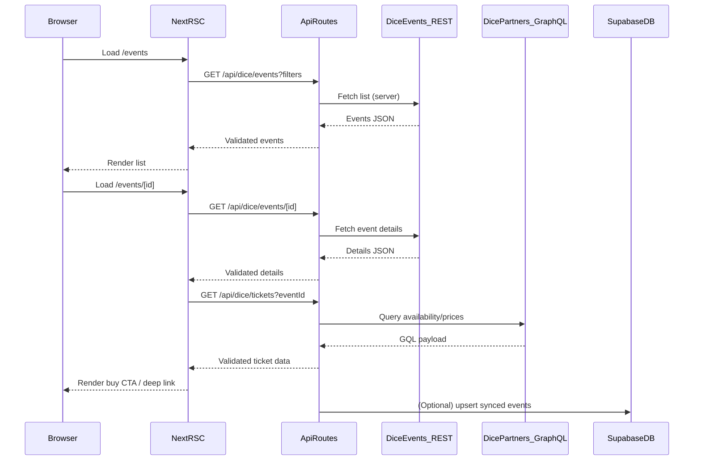

# DICE Events + Ticketing Integration Plan

## Goals

- **Public discovery**: list/browse/search events + event details.
- **Ticketing**: show availability/price tiers, **deep-link checkout**, optionally **in-app purchase** (only if your partnership supports it).
- **User**: show user orders/tickets (if the Partners API supports user-scoped queries in your setup).
- **Admin**: sync/import events into your DB for curation and performance.

## Key decisions (assumed defaults since you have no credentials yet)

- **All DICE calls are server-side only** (Route Handlers / server actions) to avoid leaking partner credentials.
- **Typed boundary everywhere**: Zod schemas for REST payloads and GraphQL responses.
- **Feature flags** to ship discovery now and progressively enable ticketing/commerce when credentials arrive.

## High-level architecture

## Implementation outline (incremental)

### 1) Add DICE integration layer (server-only)

- Create `lib/dice/` with:
- `lib/dice/events-client.ts`: REST fetch wrapper (base URL, headers, retries/backoff, request id logging)
- `lib/dice/partners-client.ts`: GraphQL fetch wrapper (POST, auth header, typed errors)
- `lib/dice/schemas.ts`: Zod schemas for **event list**, **event details**, and **ticketing payloads**
- `lib/dice/types.ts`: inferred TS types from Zod
- `lib/dice/errors.ts`: custom errors (`DiceAuthError`, `DiceRateLimitError`, `DiceUpstreamError`)

### 2) Add API routes (thin, validated, cached)

- Add Next route handlers under `app/api/dice/`:
- `app/api/dice/events/route.ts`: list with query params (date range, city, genre, pagination)
- `app/api/dice/events/[id]/route.ts`: details
- `app/api/dice/tickets/route.ts`: ticket availability/prices (GraphQL)
- `app/api/dice/checkout-link/route.ts`: generate/return a safe deep link (and enforce allowlist rules)
- Use:
- **Input validation**: Zod for query params and body payloads
- **Output validation**: Zod parse of upstream payloads
- **Caching**: `fetch(..., { next: { revalidate } })` for REST discovery; short TTL for ticket availability
- **Rate limit/429 handling**: propagate a friendly error shape to the UI

### 3) UI: Events list + details (server components first)

- Create pages in `app/events/` (or integrate into your existing `app/events/page.tsx`):
- List view consumes `/api/dice/events` via server-side fetch (RSC) with caching
- Details view consumes `/api/dice/events/[id]`
- Add reusable UI components under `components/events/`:
- `EventCard`, `EventFilters`, `EventHero`, `TicketPanel`
- Tailwind styling with light/dark tokens and responsive layout.

### 4) Ticketing UX (progressively enabled)

- **Availability + prices**: show in `TicketPanel` from `/api/dice/tickets`.
- **Deep-link checkout**: primary CTA always available when event has a DICE link.
- **In-app purchase (conditional)**:
- Only implement once you confirm the Partners API supports purchase/session creation for your account.
- If supported, add a server route to create a checkout session and redirect.

### 5) User orders/tickets (conditional on user identity model)

- Since you currently have **no DICE credentials**, plan assumes this might be either:
- partner-scoped “orders for our org” queries, or
- user-scoped queries requiring DICE OAuth.
- Implement behind a flag:
- `app/dashboard/tickets/page.tsx` calling `/api/dice/orders`
- Store minimal mapping in Supabase if you need to associate app users to DICE identities.

### 6) Admin sync/import pipeline

- Add an admin route under `app/admin/` to:
- trigger sync and view last sync status
- curate which events are visible
- Create a sync route:
- `app/api/admin/dice/sync/route.ts` (protected)
- Persist:
- event metadata, normalized venue/location, hero image URLs, start/end, DICE ids, tags
- last_synced_at and source checksum to avoid churn

### 7) Env + security

- Add env vars (server-only):
- `DICE_EVENTS_BASE_URL`
- `DICE_EVENTS_API_KEY` (when received)
- `DICE_PARTNERS_GRAPHQL_URL`
- `DICE_PARTNERS_TOKEN` (when received)
- Ensure:
- No secrets exposed to client bundles
- Route handlers enforce auth for admin/sync endpoints
- Log redaction for headers/tokens

## Edge cases to handle

- **Upstream schema drift**: Zod parse failures return a typed 502 with safe messaging.
- **Rate limiting (429)**: exponential backoff server-side + cached stale responses for list/detail.
- **Missing/partial data**: null-safe rendering for venue/lineup/images.
- **Time zones**: normalize to ISO; display with user locale but keep source tz.
- **Pagination**: stable cursor/page parameters and deterministic ordering.
- **Purchase flow**: if in-app purchase unsupported, always fall back to deep link.

## Files you’ll likely touch/add

- `lib/dice/*` (new)
- `app/api/dice/*` (new)
- `app/events/*` and/or existing `app/events/page.tsx`
- `components/events/*` (new)
- `lib/schemas/*` (optional if you centralize Zod schemas)
- `lib/db/*` + `database/*.sql` (if persisting synced events in Supabase)
- `.env.example` (document required vars)

## Acceptance criteria

- Events list + details load server-side, are validated, and render with good empty/error states.
- Ticket panel shows availability/prices when enabled; otherwise shows a safe fallback.