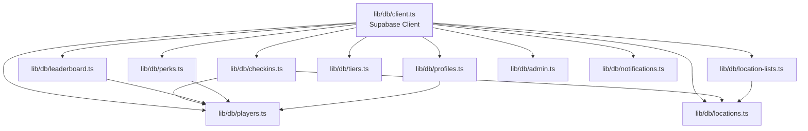

# Data Layer Architecture Documentation

This document describes the refactored data layer architecture for the Refraction frontend application.

## Overview

The data layer has been refactored from a monolithic 1300+ line `lib/supabase.ts` file into a modular, domain-driven structure. This improves maintainability, testability, and developer experience.

## Directory Structure

```
lib/
├── db/                    # Database access layer
│   ├── client.ts          # Supabase client initialization
│   ├── players.ts          # Player CRUD + multi-chain wallet linking
│   ├── locations.ts        # Location CRUD operations
│   ├── location-lists.ts   # Location list management
│   ├── checkins.ts         # Check-in operations + points updates
│   ├── leaderboard.ts      # Leaderboard queries
│   ├── perks.ts            # Perks + redemption logic
│   ├── tiers.ts            # Tier functions
│   ├── profiles.ts         # User profile management
│   ├── admin.ts            # Admin permission checks
│   └── notifications.ts    # Notification functions
├── schemas/                # Zod validation schemas
│   ├── player.ts           # Player validation schemas
│   ├── location.ts         # Location validation schemas
│   ├── perk.ts             # Perk validation schemas
│   └── index.ts            # Schema re-exports
├── types.ts                # Single source of truth for all types
└── supabase.ts             # Backward-compatible re-exports (deprecated)
```

## Type Definitions

All types are centralized in `lib/types.ts`:

| Type | Description | Module |
|------|-------------|--------|
| `Player` | User account with multi-chain wallet support (EVM, Solana, Stellar) | `lib/types.ts` |
| `Location` | Check-in location with coordinates and coin data | `lib/types.ts` |
| `LocationList` | Curated collection of locations | `lib/types.ts` |
| `LocationListWithCount` | Location list with location count | `lib/types.ts` |
| `LocationListLocation` | Location membership in a location list | `lib/types.ts` |
| `LocationOption` | Simplified location option for dropdowns/search | `lib/types.ts` |
| `PlayerLocationCheckin` | Record of user check-in at a location | `lib/types.ts` |
| `LeaderboardEntry` | Aggregated player stats for ranking | `lib/types.ts` |
| `Perk` | Redeemable reward with points threshold | `lib/types.ts` |
| `PerkDiscountCode` | Discount codes associated with perks | `lib/types.ts` |
| `UserPerkRedemption` | Record of perk redemption by user | `lib/types.ts` |
| `Tier` | Points-based membership tier | `lib/types.ts` |
| `UserProfile` | Extended profile with social handles | `lib/types.ts` |
| `Checkin` | Legacy checkin type (deprecated) | `lib/types.ts` |

## Module Dependency Diagram



## Module Reference

### `lib/db/client.ts`

**Purpose**: Supabase client initialization

**Exports**:
- `supabase`: Supabase client instance with service role permissions

**Usage**:
```typescript
import { supabase } from "@/lib/db/client";
```

---

### `lib/db/players.ts`

**Purpose**: Player CRUD operations and multi-chain wallet linking

**Exports**:
- `createOrUpdatePlayer(player)` - Create or update player by wallet address
- `getPlayerByWallet(walletAddress)` - Get player by EVM wallet
- `getPlayerBySolanaWallet(address)` - Get player by Solana wallet
- `getPlayerByStellarWallet(address)` - Get player by Stellar wallet
- `getPlayerByEmail(email)` - Get player by email
- `createOrUpdatePlayerForSolana(address, email?)` - Create/update Solana player
- `createOrUpdatePlayerForStellar(address, email?, walletId?)` - Create/update Stellar player
- `updatePlayerPoints(playerId, pointsToAdd)` - Add points to player

**Dependencies**: `lib/db/client.ts`

**Example**:
```typescript
import { getPlayerByWallet, updatePlayerPoints } from "@/lib/db/players";

const player = await getPlayerByWallet("0x...");
await updatePlayerPoints(player.id, 100);
```

---

### `lib/db/locations.ts`

**Purpose**: Location CRUD operations

**Exports**:
- `createOrGetLocation(locationData)` - Create location or return existing by place_id
- `listAllLocations()` - List all locations
- `listLocationsByWallet(walletAddress)` - List locations checked in by wallet
- `updateLocationById(locationId, updates)` - Update location fields
- `listLocationOptions(search?, limit?)` - Search locations for dropdowns

**Dependencies**: `lib/db/client.ts`

**Example**:
```typescript
import { createOrGetLocation, listLocationOptions } from "@/lib/db/locations";

const location = await createOrGetLocation({
  name: "Coffee Shop",
  display_name: "Coffee Shop",
  latitude: 40.7128,
  longitude: -74.0060,
  place_id: "ChIJ...",
  points_value: 10,
});

const options = await listLocationOptions("coffee", 10);
```

---

### `lib/db/location-lists.ts`

**Purpose**: Location list management

**Exports**:
- `getLocationLists()` - Get all lists with location counts
- `createLocationList(payload)` - Create new location list
- `updateLocationList(id, updates)` - Update location list
- `deleteLocationList(id)` - Delete location list
- `getLocationsForList(listId)` - Get all locations in a list
- `addLocationToList(listId, locationId)` - Add location to list
- `removeLocationFromList(listId, locationId)` - Remove location from list

**Dependencies**: `lib/db/client.ts`, `lib/types.ts`

**Example**:
```typescript
import { createLocationList, addLocationToList } from "@/lib/db/location-lists";

const list = await createLocationList({
  title: "NYC Coffee Shops",
  slug: "nyc-coffee-shops",
  description: "Best coffee in NYC",
});

await addLocationToList(list.id, locationId);
```

---

### `lib/db/checkins.ts`

**Purpose**: Check-in operations and points updates

**Exports**:
- `checkUserLocationCheckin(playerId, locationId)` - Check if user checked in
- `createLocationCheckin(checkin)` - Create new location check-in
- `insertCheckin(checkin)` - Legacy checkpoint checkin (deprecated)
- `upsertCheckpoint(address, email, checkpoint)` - Legacy checkpoint upsert (deprecated)
- `getCheckinByAddress(address)` - Legacy get checkins (deprecated)
- `getCheckinByAddressAndCheckpoint(address, checkpoint)` - Legacy filtered checkins (deprecated)

**Dependencies**: `lib/db/client.ts`, `lib/types.ts`

**Example**:
```typescript
import { createLocationCheckin, checkUserLocationCheckin } from "@/lib/db/checkins";

const existing = await checkUserLocationCheckin(playerId, locationId);
if (!existing) {
  await createLocationCheckin({
    player_id: playerId,
    location_id: locationId,
    points_earned: 10,
  });
}
```

---

### `lib/db/leaderboard.ts`

**Purpose**: Leaderboard queries

**Exports**:
- `getLeaderboard(limit?, offset?)` - Get leaderboard entries with pagination
- `getPlayerStats(playerId)` - Get detailed player stats with check-in history

**Dependencies**: `lib/db/client.ts`, `lib/types.ts`

**Example**:
```typescript
import { getLeaderboard, getPlayerStats } from "@/lib/db/leaderboard";

const top50 = await getLeaderboard(50, 0);
const stats = await getPlayerStats(playerId);
```

---

### `lib/db/perks.ts`

**Purpose**: Perk management and redemption

**Exports**:
- `createPerk(perk)` - Create new perk
- `updatePerk(id, updates)` - Update perk
- `deletePerk(id)` - Delete perk
- `getAllPerks(activeOnly?)` - Get all perks
- `getPerkById(id)` - Get perk by ID
- `getAvailablePerksForUser(walletAddress)` - Get available perks for user
- `redeemPerk(perkId, walletAddress)` - Redeem perk for user
- `getUserPerkRedemptions(walletAddress)` - Get user's redemptions
- `createDiscountCodes(perkId, codes, isUniversal?)` - Create discount codes
- `getDiscountCodesByPerkId(perkId)` - Get codes for perk
- `deleteDiscountCode(codeId)` - Delete discount code
- `getAvailableCodesCount(perkId)` - Get count of available codes

**Dependencies**: `lib/db/client.ts`, `lib/db/players.ts`, `lib/types.ts`

**Example**:
```typescript
import { redeemPerk, getAvailablePerksForUser } from "@/lib/db/perks";

const available = await getAvailablePerksForUser(walletAddress);
const redemption = await redeemPerk(perkId, walletAddress);
```

---

### `lib/db/tiers.ts`

**Purpose**: Tier management

**Exports**:
- `getTiers()` - Get all tiers ordered by min_points
- `resolveTierForPoints(tiers, totalPoints)` - Resolve tier for point total
- `getTierForPoints(totalPoints)` - Get tier for point total

**Dependencies**: `lib/db/client.ts`, `lib/types.ts`

**Example**:
```typescript
import { getTierForPoints } from "@/lib/db/tiers";

const tier = await getTierForPoints(player.total_points);
```

---

### `lib/db/profiles.ts`

**Purpose**: User profile management

**Exports**:
- `createOrUpdateUserProfile(profile)` - Create or update profile
- `getUserProfile(walletAddress)` - Get user profile
- `updateUserProfile(walletAddress, updates)` - Update profile fields
- `awardProfileFieldPoints(walletAddress, fieldType, fieldValue)` - Award points for profile completion

**Dependencies**: `lib/db/client.ts`, `lib/types.ts`

**Example**:
```typescript
import { updateUserProfile, awardProfileFieldPoints } from "@/lib/db/profiles";

await updateUserProfile(walletAddress, {
  username: "newusername",
  twitter_handle: "@handle",
});

await awardProfileFieldPoints(walletAddress, "profile_field_twitter", "@handle");
```

---

### `lib/db/admin.ts`

**Purpose**: Admin permission checks

**Exports**:
- `ADMIN_EMAILS` - Array of admin email addresses
- `checkAdminPermission(email)` - Check if email has admin permissions

**Dependencies**: None

**Example**:
```typescript
import { checkAdminPermission } from "@/lib/db/admin";

if (checkAdminPermission(user.email)) {
  // Admin-only code
}
```

---

### `lib/db/notifications.ts`

**Purpose**: Notification management

**Exports**:
- `insertNotification(notification)` - Insert webhook notification

**Dependencies**: `lib/db/client.ts`, `lib/types.ts`

---

## Zod Validation Schemas

Validation schemas are located in `lib/schemas/`:

### `lib/schemas/player.ts`

- `walletAddressSchema` - EVM wallet address validation
- `solanaWalletAddressSchema` - Solana wallet address validation
- `stellarWalletAddressSchema` - Stellar wallet address validation
- `createPlayerSchema` - Player creation validation
- `updateUserProfileSchema` - Profile update validation
- `awardProfileFieldPointsSchema` - Profile field points validation

### `lib/schemas/location.ts`

- `latitudeSchema` - Latitude validation (-90 to 90)
- `longitudeSchema` - Longitude validation (-180 to 180)
- `createLocationSchema` - Location creation validation
- `updateLocationSchema` - Location update validation
- `locationSearchSchema` - Location search validation

### `lib/schemas/perk.ts`

- `createPerkSchema` - Perk creation validation
- `updatePerkSchema` - Perk update validation
- `redeemPerkSchema` - Perk redemption validation
- `createDiscountCodesSchema` - Discount code creation validation
- `createLocationListSchema` - Location list creation validation
- `updateLocationListSchema` - Location list update validation

**Usage Example**:
```typescript
import { createPlayerSchema } from "@/lib/schemas/player";
import { createLocationSchema } from "@/lib/schemas/location";

// In API route
const validated = createPlayerSchema.parse(requestBody);
const location = createLocationSchema.parse(locationData);
```

## Migration Guide

### For Existing Code

All existing imports from `@/lib/supabase` will continue to work due to backward-compatible re-exports. However, new code should import directly from domain modules:

**Old (still works)**:
```typescript
import { getPlayerByWallet, createPerk } from "@/lib/supabase";
```

**New (recommended)**:
```typescript
import { getPlayerByWallet } from "@/lib/db/players";
import { createPerk } from "@/lib/db/perks";
```

### Benefits of Direct Imports

1. **Tree-shaking**: Only imports what you need
2. **Clarity**: Makes dependencies explicit
3. **Type safety**: Better IDE autocomplete
4. **Future-proof**: Ready for when `lib/supabase.ts` is deprecated

## Best Practices

1. **Import from domain modules**: Use `lib/db/*` instead of `lib/supabase`
2. **Use Zod schemas**: Validate API inputs with schemas from `lib/schemas`
3. **Type imports**: Import types from `lib/types` for consistency
4. **Error handling**: All database functions throw errors - handle them appropriately
5. **JSDoc comments**: All exported functions have JSDoc comments

## Error Handling

All database functions throw errors that should be caught:

```typescript
try {
  const player = await getPlayerByWallet(address);
} catch (error) {
  // Handle error
  console.error("Failed to get player:", error);
}
```

Common error codes:
- `PGRST116`: Record not found (some functions return `null` instead of throwing)

## Testing

Each module can be tested independently:

```typescript
import { getPlayerByWallet } from "@/lib/db/players";

// Mock supabase client
jest.mock("@/lib/db/client", () => ({
  supabase: mockSupabase,
}));
```

## Future Improvements

1. **Remove backward compatibility**: Once all code migrates, remove `lib/supabase.ts`
2. **Add more Zod schemas**: Expand validation coverage
3. **Add unit tests**: Test each module independently
4. **Add integration tests**: Test database operations end-to-end
5. **Add caching layer**: Implement Redis caching for frequently accessed data

