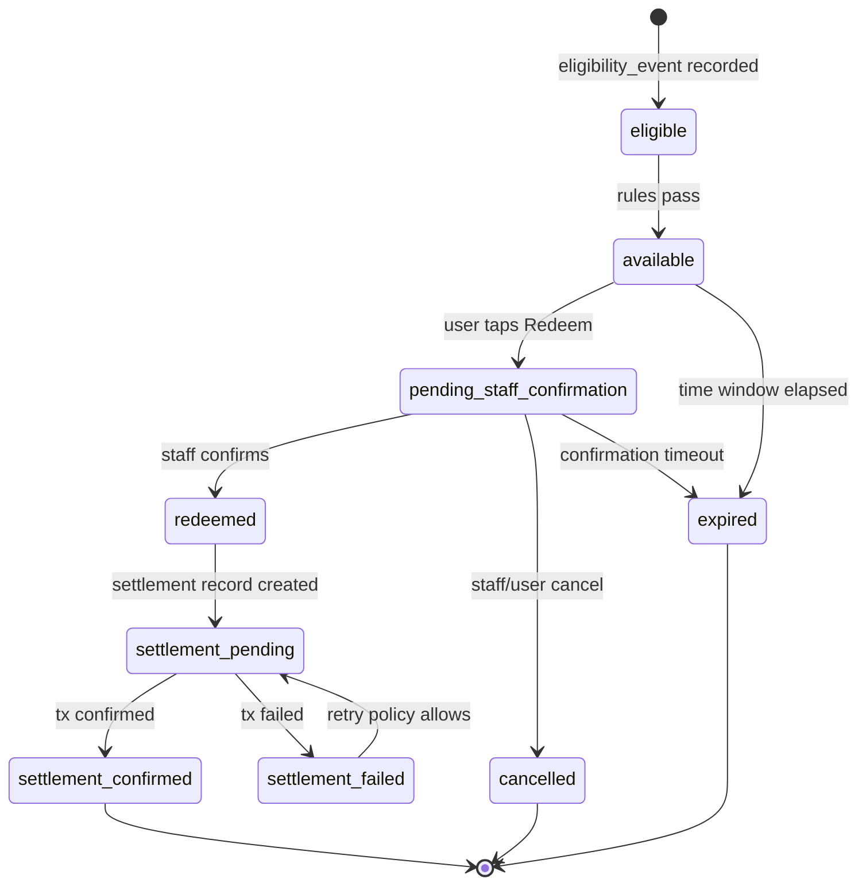
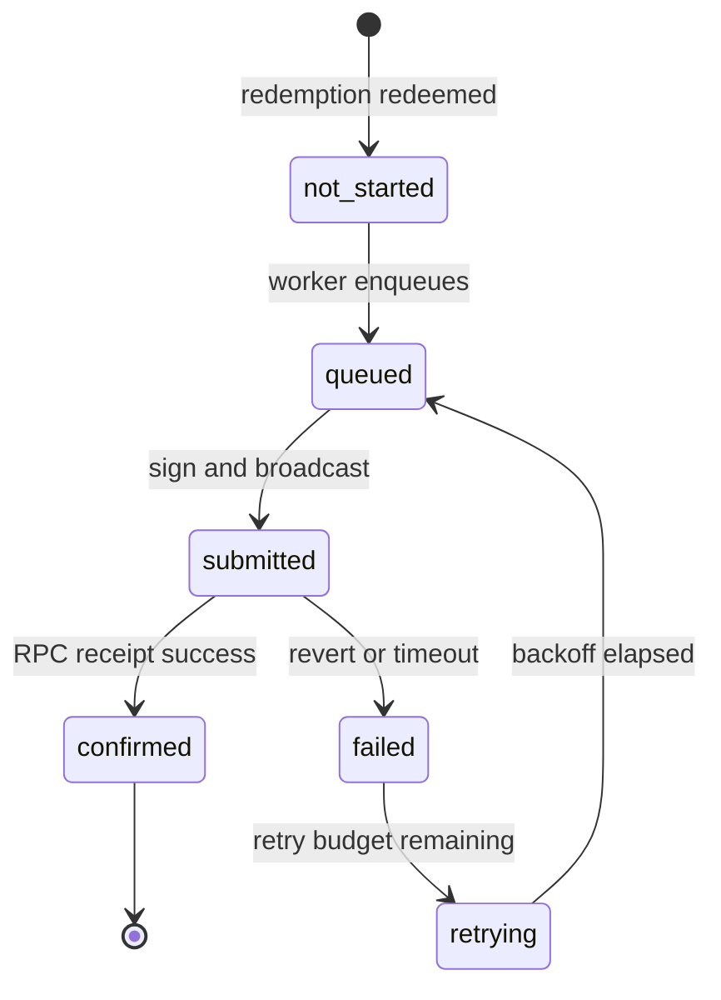

# Public Records Sponsored USDC Activation — Product Requirements Document

**Status:** Draft (implementation not started)  
**Pilot:** Public Records  
**Last updated:** 2026-05-20  
**Related docs:** `plans/irl-spend-pilot-technical-prd.md` (user-wallet USDC spend rail — explicitly different), `docs/APP_OVERVIEW.md`, `docs/stellar-baselines-and-chain-architecture.md`

---

## Summary

IRL will run a **sponsor-funded cultural activation** at Public Records where a **campaign wallet** is prefunded with USDC. Attendees **earn and redeem real-world perks** (e.g. drink credit) through familiar IRL flows—check-in, QR, staff confirmation—**without receiving, holding, or withdrawing USDC**.

On each confirmed redemption, the system records an **individual onchain USDC transfer** from the **campaign wallet** to a **venue settlement wallet** configured per event. Settlement may be **asynchronous**, but every transfer must remain **attributable to exactly one user redemption** so sponsor/investor dashboards can show **per-user transaction hashes** as proof of sponsor-funded spend.

**User-facing:** perk redemption.  
**Backend:** sponsor USDC settlement to venue.

---

## Background / context

### Problem

Partners and sponsors want **verifiable proof** that marketing dollars funded **real cultural attendance and venue spend**, not opaque off-chain redemptions. Users want **simple perks**, not crypto conversion UX.

### Existing IRL rails (distinction)

| Rail                              | User receives USDC?   | Onchain path                                  | Pilot relevance                           |
| --------------------------------- | --------------------- | --------------------------------------------- | ----------------------------------------- |
| Perks / rewards                   | No                    | None (codes/links)                            | UX reference for “redeem a perk”          |
| Spend pilot (`spend_experiences`) | Yes — embedded wallet | Treasury → user → receiving wallet            | **Out of scope** — opposite custody model |
| **This activation**               | **No**                | **Campaign wallet → venue settlement wallet** | **In scope**                              |

Privy remains the auth and identity layer (email/social, embedded wallet creation for future rails). For this pilot, **embedded wallets are not USDC payout destinations**.

### Pilot sponsor narrative

Public Records (venue) + sponsor/IRL campaign wallet demonstrate **sponsor-funded cultural spend onchain** while the attendee experience stays **IRL-native**: check in, redeem drink, staff confirms.

### North star (explicitly deferred)

Long-term, user-controlled USDC wallets across many venues may be desirable. **This pilot does not send USDC to user wallets** and does not enable user withdrawal of campaign funds.

---

## Goals

1. **User experience:** Redemption feels like claiming a venue perk, not converting or spending crypto.
2. **Sponsor proof:** Each confirmed redemption produces (or queues) **one distinct onchain USDC transaction** with a **public tx hash** tied to that redemption.
3. **Custody:** Users **never** receive withdrawable USDC from the campaign wallet.
4. **Settlement path:** USDC moves **campaign wallet → venue settlement wallet** only.
5. **Operations:** Admin can configure activation, caps, wallets, rewards, and eligibility; staff can confirm redemptions; dashboard shows budget, settlements, and failures.
6. **Attribution:** Async settlement is allowed; **redemption_id** (and user/event) must always link to at most one settlement attempt chain and one confirmed tx hash.
7. **Auditability:** Backend can reconstruct eligibility → redemption → settlement for support and investor review.

---

## Non-goals

- Sending USDC to **user** embedded or external wallets.
- User-visible “convert points to USDC” or “pay with USDC” flows.
- **Batching** multiple redemptions into a single onchain transfer (breaks per-user proof requirement).
- Token-level spend restrictions, escrow contracts, or new smart contracts (unless separately approved).
- Multi-venue marketplace settlement logic beyond one activation’s configured venue wallet.
- Manual sponsor treasury top-up UI beyond documenting operator process (v1 may use existing wallet ops).
- Geofencing as the sole eligibility mechanism (check-in/QR/staff/POS signals are in scope; geofence-only is not required).
- Replacing or overloading `spend_items` / spend pilot tables without a dedicated activation schema.
- Stellar or non-Base chains for v1 (default **Base USDC** unless admin explicitly configures another supported EVM rail later).

---

## User stories

| ID  | Story                                                                                                                                                                | Acceptance hint                                          |
| --- | -------------------------------------------------------------------------------------------------------------------------------------------------------------------- | -------------------------------------------------------- |
| U1  | As an attendee, I scan a checkpoint/activation QR and sign in so I can see my eligible perk.                                                                         | Eligibility evaluated server-side after Privy auth.      |
| U2  | As an attendee, I complete check-in (or equivalent eligibility action) and see a simple reward (e.g. “Redeem drink”) with **no crypto amounts** in primary CTA copy. | UI shows perk title/status only; USDC not shown to user. |
| U3  | As an attendee, I tap redeem and see “pending staff confirmation” until staff confirms.                                                                              | State `pending_staff_confirmation` visible to user.      |
| U4  | As an attendee, after staff confirms, I see “Redeemed” and optional receipt id/time—not a wallet tx.                                                                 | No tx hash required in user UI for v1.                   |
| U5  | As an attendee, I cannot redeem the same reward twice when campaign rules disallow it.                                                                               | Idempotent redemption rules enforced server-side.        |
| U6  | As an attendee, if my redemption window expires, I see a clear expired/cancelled state.                                                                              | Terminal state `cancelled` or `expired` with reason.     |

---

## Admin stories

| ID  | Story                                                                                                                                      | Acceptance hint                                                          |
| --- | ------------------------------------------------------------------------------------------------------------------------------------------ | ------------------------------------------------------------------------ |
| A1  | As an admin, I create a **sponsored activation** tied to an event with sponsor name, campaign wallet, venue settlement wallet, and status. | All required fields validated; wallets checksum-validated.               |
| A2  | As an admin, I configure **reward item(s)** with display name, USDC value per redemption, and optional points/eligibility rules.           | Reward USDC value sums into budget accounting.                           |
| A3  | As an admin, I set **redemption cap** and/or **USDC budget cap** for the activation.                                                       | Redemptions blocked when cap exceeded; dashboard shows remaining budget. |
| A4  | As an admin, I link **checkpoint / check-in / QR** eligibility rules to the activation.                                                    | Ineligible users cannot reach `available` redeem state.                  |
| A5  | As an admin, I view activation dashboard metrics and exportable redemption/settlement list.                                                | See Dashboard requirements.                                              |
| A6  | As an admin, I can disable an activation (no new redemptions; in-flight settlement continues or fails visibly).                            | `activation.status = paused/ended` enforced on new redemptions.          |

---

## Venue / staff stories

| ID  | Story                                                                                                           | Acceptance hint                                                                     |
| --- | --------------------------------------------------------------------------------------------------------------- | ----------------------------------------------------------------------------------- |
| S1  | As staff, I open a staff-facing list of redemptions for this activation/event filtered by pending confirmation. | Shows user pseudonym/id, reward, time, status.                                      |
| S2  | As staff, I confirm a pending redemption so the patron receives credit at the bar/POS.                          | Transition to `redeemed`; triggers settlement pipeline.                             |
| S3  | As staff, I see whether a patron already redeemed so I do not double-serve.                                     | `redeemed` / `settlement_*` states visible.                                         |
| S4  | As staff, I can mark a redemption cancelled before confirmation (wrong ticket, fraud suspicion) with reason.    | `cancelled` terminal; no settlement started.                                        |
| S5  | As staff, optional POS/NFC/ticket scan event marks eligibility without exposing crypto.                         | Eligibility event recorded; same UX as existing checkpoint patterns where possible. |

---

## Sponsor / investor dashboard stories

| ID  | Story                                                                                                                                                             | Acceptance hint                                                    |
| --- | ----------------------------------------------------------------------------------------------------------------------------------------------------------------- | ------------------------------------------------------------------ |
| D1  | As a sponsor viewer, I see total **check-ins verified**, **redemptions confirmed**, and **USDC settled** for the activation.                                      | Numbers reconcile with sum of confirmed settlement amounts.        |
| D2  | As a sponsor viewer, I see **budget remaining** (configured cap minus settled minus queued).                                                                      | Formula documented in dashboard spec.                              |
| D3  | As a sponsor viewer, I browse a **transaction hash feed** with one row per confirmed settlement linked to a redemption.                                           | No batched tx representing multiple users.                         |
| D4  | As a sponsor viewer, I drill into a redemption and see user id (pseudonymous), event, reward, redemption status, settlement status, tx hash, block explorer link. | Drilldown matches onchain transfer amount to `reward.usdc_amount`. |
| D5  | As a sponsor viewer, I see **failed/pending settlements** with retry status and age.                                                                              | Actionable ops list, not only aggregates.                          |

---

## Functional requirements

### FR-1 Activation lifecycle

- **FR-1.1** Admin can create/update activation in `draft`; only `active` activations accept new eligibility/redemptions within window.
- **FR-1.2** Activation stores: sponsor/campaign display name, `campaign_wallet_address`, `venue_settlement_wallet_address`, time window, caps, linked event/checkpoint ids, status.
- **FR-1.3** Ending activation prevents **new** redemptions; existing `settlement_pending` items continue processing.

### FR-2 Eligibility

- **FR-2.1** User must authenticate via Privy before redemption UI.
- **FR-2.2** System records an **eligibility event** (check-in, checkpoint scan, ticket scan, NFC, staff-granted, etc.) before redemption becomes `available`.
- **FR-2.3** Eligibility rules are configurable per activation (e.g. one check-in per user per day, one reward per user per activation).
- **FR-2.4** QR/checkpoint opens activation deep link; server validates activation id and signed/opaque token if used by existing checkpoint patterns.

### FR-3 Redemption (user + staff)

- **FR-3.1** User initiates redeem → `pending_staff_confirmation` unless staff-less mode is explicitly configured (default: staff confirmation required for Public Records pilot).
- **FR-3.2** Staff confirmation transitions to `redeemed` and consumes redemption cap / budget reservation.
- **FR-3.3** User-facing copy must not reference USDC, wallets, or “crypto conversion.”
- **FR-3.4** One logical redemption maps to at most one reward item instance and one settlement chain.

### FR-4 Settlement (backend)

- **FR-4.1** On `redeemed`, system creates a **settlement transaction** record in `not_started` → `queued`.
- **FR-4.2** Settlement transfers **exactly** `reward.usdc_amount` (or configured amount at redemption time snapshot) from **campaign wallet** to **venue settlement wallet** on Base USDC.
- **FR-4.3** **No** transfer to `user.wallet_address`.
- **FR-4.4** One redemption → one onchain transfer (no batching). Retries reuse the same logical settlement id with new submission attempts tracked in metadata.
- **FR-4.5** On chain confirmation, redemption moves to `settlement_confirmed` and stores `tx_hash`, `chain_id`, `amount`, `from`, `to`, `confirmed_at`.
- **FR-4.6** Async settlement allowed: redemption may sit in `settlement_pending` while worker processes queue.
- **FR-4.7** Campaign wallet balance check before submit; insufficient funds → `settlement_failed` with reason `campaign_insufficient_funds` and ops alert.

### FR-5 Budget and caps

- **FR-5.1** Support `max_redemptions` (count) and/or `max_usdc_budget` (sum of settlement amounts).
- **FR-5.2** Reserve budget on `redeemed`; release on `cancelled` before settlement submit; finalize decrement on `settlement_confirmed`.
- **FR-5.3** Block new redemptions when cap exceeded (user message: “This perk is no longer available”).

### FR-6 Wallets and signing

- **FR-6.1** Campaign wallet is a **Privy server wallet** or otherwise IRL-controlled signer documented in runbook (same operational model as spend pilot treasury).
- **FR-6.2** Venue settlement wallet is **admin-configured**, validated as an address on the activation chain.
- **FR-6.3** Private keys never exposed to client; all transfers initiated server-side.

### FR-7 Idempotency

- **FR-7.1** Idempotency key: `activation_id + user_id + reward_item_id + eligibility_event_id` (or stricter rule if one reward per user per activation).
- **FR-7.2** Duplicate staff confirm or duplicate settlement worker invocations must not double-transfer USDC.
- **FR-7.3** Unique DB constraint: one `confirmed` settlement per `redemption_id`.

### FR-8 Integration with existing app

- Reuse Privy auth (`lib/api/privy.ts`), player records, checkpoint/check-in flows, admin auth (`lib/auth.ts`), API response helpers (`lib/api/response.ts`), Mixpanel helpers (`lib/analytics/`), and Base USDC constants from existing wallet/spend code where applicable.
- **New tables** preferred over overloading `spend_redemptions` to keep audit trails distinct.

---

## Data model / key entities

Logical entities for implementation (SQL names illustrative).

### `sponsored_activation` (activation / event)

| Field                             | Type        | Notes                                     |
| --------------------------------- | ----------- | ----------------------------------------- |
| `id`                              | uuid        | PK                                        |
| `slug`                            | text        | Public Records pilot slug                 |
| `title`                           | text        | Display                                   |
| `sponsor_name`                    | text        | Sponsor/campaign label                    |
| `event_id`                        | uuid?       | FK to events if present                   |
| `status`                          | enum        | `draft`, `active`, `paused`, `ended`      |
| `campaign_wallet_address`         | text        | Source of USDC                            |
| `venue_settlement_wallet_address` | text        | Destination                               |
| `chain`                           | text        | Default `base`                            |
| `usdc_token_address`              | text        | Base USDC contract                        |
| `max_redemptions`                 | int?        | Count cap                                 |
| `max_usdc_budget`                 | numeric?    | Budget cap                                |
| `usdc_settled_total`              | numeric     | Running confirmed sum                     |
| `redemption_count_confirmed`      | int         | Running count                             |
| `starts_at` / `ends_at`           | timestamptz | Activation window                         |
| `eligibility_config`              | jsonb       | Rules: checkpoint ids, max per user, etc. |
| `created_by`                      | uuid/text   | Admin                                     |
| `created_at` / `updated_at`       | timestamptz |                                           |

### `activation_reward_item` (reward item)

| Field           | Type    | Notes                            |
| --------------- | ------- | -------------------------------- |
| `id`            | uuid    | PK                               |
| `activation_id` | uuid    | FK                               |
| `name`          | text    | e.g. “Drink credit”              |
| `description`   | text?   | Staff/user helper                |
| `usdc_amount`   | numeric | Settlement amount per redemption |
| `sort_order`    | int     | UI ordering                      |
| `is_active`     | bool    |                                  |
| `max_per_user`  | int?    | Default 1 for pilot              |

### `activation_eligibility_event` (user check-in / eligibility)

| Field            | Type        | Notes                                                                                           |
| ---------------- | ----------- | ----------------------------------------------------------------------------------------------- |
| `id`             | uuid        | PK                                                                                              |
| `activation_id`  | uuid        | FK                                                                                              |
| `user_id`        | uuid        | Player                                                                                          |
| `wallet_address` | text?       | Identity reference, not payout target                                                           |
| `source`         | enum        | `checkpoint_checkin`, `location_checkin`, `qr_scan`, `nfc`, `ticket_scan`, `staff_grant`, `pos` |
| `source_ref_id`  | text?       | Checkpoint id, check-in id, etc.                                                                |
| `occurred_at`    | timestamptz |                                                                                                 |
| `metadata`       | jsonb       | Device, staff id, etc.                                                                          |

### `activation_redemption` (redemption)

| Field                       | Type         | Notes                        |
| --------------------------- | ------------ | ---------------------------- |
| `id`                        | uuid         | PK                           |
| `activation_id`             | uuid         | FK                           |
| `reward_item_id`            | uuid         | FK                           |
| `user_id`                   | uuid         | FK                           |
| `eligibility_event_id`      | uuid         | FK                           |
| `status`                    | enum         | See redemption state machine |
| `usdc_amount_snapshot`      | numeric      | Frozen at redeem time        |
| `staff_confirmed_by`        | text?        | Staff operator id            |
| `staff_confirmed_at`        | timestamptz? |                              |
| `cancelled_reason`          | text?        |                              |
| `idempotency_key`           | text         | Unique                       |
| `created_at` / `updated_at` | timestamptz  |                              |

### `activation_settlement_transaction` (settlement)

| Field                                         | Type         | Notes                        |
| --------------------------------------------- | ------------ | ---------------------------- |
| `id`                                          | uuid         | PK                           |
| `redemption_id`                               | uuid         | FK unique for confirmed      |
| `activation_id`                               | uuid         | FK                           |
| `status`                                      | enum         | See settlement state machine |
| `amount`                                      | numeric      | USDC                         |
| `from_wallet_address`                         | text         | Campaign                     |
| `to_wallet_address`                           | text         | Venue                        |
| `tx_hash`                                     | text?        | Set on confirm               |
| `chain_id`                                    | int?         | Base                         |
| `submission_attempt`                          | int          | Retry counter                |
| `last_error_code`                             | text?        | Sanitized                    |
| `last_error_message`                          | text?        | Ops only                     |
| `queued_at` / `submitted_at` / `confirmed_at` | timestamptz? |                              |
| `privy_transaction_id`                        | text?        | If applicable                |

### `activation_dashboard_snapshot` (optional materialized metrics)

May be computed view rather than table: check-ins count, redemptions by status, USDC settled, budget remaining, failed settlement count.

### Entity relationships (ASCII)

```
sponsored_activation
  ├── activation_reward_item (1:N)
  ├── activation_eligibility_event (1:N)
  └── activation_redemption (1:N)
        └── activation_settlement_transaction (1:1)
```

---

## Event / admin configuration requirements

Admin UI/API must support configuring at minimum:

| Config                                     | Required           | Validation                        |
| ------------------------------------------ | ------------------ | --------------------------------- |
| Sponsor / campaign name                    | Yes                | Non-empty                         |
| Campaign wallet address                    | Yes                | EVM checksum, matches chain       |
| Venue settlement wallet address            | Yes                | EVM checksum, ≠ campaign wallet   |
| Reward item name + USDC amount             | Yes (≥1 item)      | `usdc_amount > 0`                 |
| Redemption cap and/or USDC budget          | Yes (at least one) | Positive integers/decimals        |
| Activation window (`starts_at`, `ends_at`) | Yes                | `ends_at > starts_at`             |
| Linked checkpoint(s) or event id           | Yes for PR pilot   | Must exist in DB                  |
| Eligibility rules JSON                     | Yes                | Schema-validated (Zod)            |
| Staff confirmation required                | Yes (default true) | Boolean                           |
| Status                                     | Yes                | Only `active` exposes user redeem |

**Public Records pilot defaults (configurable, not hardcoded in code):**

- Reward: “Drink credit” — USDC amount TBD by sponsor (e.g. $8–$15 equivalent).
- One redemption per user per activation unless ops overrides.
- Staff confirmation required at bar.
- Base USDC, campaign wallet prefunded before `active`.

---

## Redemption state machine

### States

| State                        | Description                                  | User-visible                           | Staff-visible                       |
| ---------------------------- | -------------------------------------------- | -------------------------------------- | ----------------------------------- |
| `eligible`                   | User met eligibility; redeem not yet started | Optional “You unlocked a perk”         | —                                   |
| `available`                  | Redeem CTA enabled                           | “Redeem drink”                         | —                                   |
| `pending_staff_confirmation` | User requested redeem; awaiting staff        | “Waiting for staff”                    | “Confirm” action                    |
| `redeemed`                   | Staff confirmed; perk consumed in product    | “Redeemed”                             | “Redeemed”                          |
| `settlement_pending`         | Settlement queued or submitted               | “Redeemed” (no change)                 | Same                                |
| `settlement_confirmed`       | Onchain tx confirmed                         | “Redeemed”                             | “Settled” + optional internal badge |
| `settlement_failed`          | Settlement failed after redeem               | “Redeemed — processing” or ops message | Alert                               |
| `cancelled`                  | Voided before/at staff confirm               | “Cancelled”                            | “Cancelled”                         |
| `expired`                    | Window or hold expired                       | “Expired”                              | —                                   |

### Transitions



### Invariants

- `settlement_*` states only occur after `redeemed`.
- `settlement_confirmed` implies exactly one non-null `tx_hash` on the linked settlement row.
- User never transitions to a state that implies user custody of USDC.

---

## Settlement state machine

Independent settlement record states (linked 1:1 to redemption after `redeemed`).

| State         | Description                                            |
| ------------- | ------------------------------------------------------ |
| `not_started` | Redemption just confirmed; worker not yet picked up    |
| `queued`      | Eligible for worker; budget reserved                   |
| `submitted`   | Tx broadcast; hash may be pending                      |
| `confirmed`   | Tx confirmed onchain                                   |
| `failed`      | Terminal failure for this attempt                      |
| `retrying`    | Backoff retry in progress (subset of queued/submitted) |

### Transitions



### Mapping to redemption status

| Settlement status                                | Redemption status      |
| ------------------------------------------------ | ---------------------- |
| `not_started`, `queued`, `submitted`, `retrying` | `settlement_pending`   |
| `confirmed`                                      | `settlement_confirmed` |
| `failed` (exhausted retries)                     | `settlement_failed`    |

---

## Dashboard requirements

### Aggregate tiles (activation scope)

| Metric                | Definition                                                                             | Test                      |
| --------------------- | -------------------------------------------------------------------------------------- | ------------------------- |
| Check-ins verified    | Count of `activation_eligibility_event` for activation                                 | Matches eligibility table |
| Redemptions created   | Count `activation_redemption` all statuses except `eligible`                           | Includes pending          |
| Redemptions confirmed | Count in `redeemed`, `settlement_pending`, `settlement_confirmed`, `settlement_failed` |                           |
| USDC settled          | Sum `amount` where settlement `confirmed`                                              | Equals onchain sum ±0     |
| Budget remaining      | `max_usdc_budget - usdc_settled_total - reserved_pending`                              | Document reserved formula |
| Redemptions remaining | `max_redemptions - redemption_count_confirmed` if count cap                            |                           |

### Transaction hash feed

- One row per **confirmed** settlement: `confirmed_at`, `tx_hash`, `amount`, `user_id` (pseudonym), `reward_item.name`, explorer link.
- Sort: newest first.
- **Must not** show batched multi-user transfers.

### Failed / pending settlement list

- Filter: settlement in `queued`, `submitted`, `retrying`, or `failed`.
- Columns: redemption id, user, reward, amount, status, attempt count, last error (sanitized), age.
- Ops action: manual retry trigger (admin-only) if within policy.

### Per-redemption drilldown

- User id / username / wallet (for support, not payout).
- Event / activation title.
- Reward item + snapshot amount.
- Redemption status timeline timestamps.
- Settlement status + `tx_hash` + explorer URL when confirmed.
- Linked eligibility event source + timestamp.

### Access control

- Admin: full dashboard + config.
- Sponsor/investor role: read-only aggregates and feed (no PII beyond pseudonym policy).

---

## Error and retry behavior

| Error                       | User impact                         | System behavior                                           |
| --------------------------- | ----------------------------------- | --------------------------------------------------------- |
| Activation inactive / ended | Cannot start redeem                 | 4xx with clear message                                    |
| Eligibility not met         | No redeem CTA                       | Stay `eligible` or hidden                                 |
| Cap / budget exceeded       | “No longer available”               | Block at `available` → redeem                             |
| Duplicate redeem            | “Already redeemed”                  | Idempotent return existing row                            |
| Staff confirm race          | Single winner                       | DB transaction / unique constraint                        |
| Campaign insufficient USDC  | User still sees redeemed; ops alert | `settlement_failed`, retry after fund                     |
| RPC timeout                 | None                                | `submitted` → poll; then retry                            |
| Tx reverted                 | None                                | `failed` → `retrying` with backoff                        |
| Duplicate worker submit     | None                                | Idempotency on settlement id; no second tx if hash exists |

### Retry policy (v1 defaults)

- Max **5** attempts per settlement over **24h** with exponential backoff (30s, 2m, 10m, 30m, 2h).
- After exhaustion: `settlement_failed`, redemption `settlement_failed`, dashboard alert.
- Retries must **not** create a second confirmed tx for the same `redemption_id`.

### User messaging

- Never show raw RPC errors, wallet addresses, or “insufficient gas” to attendees.
- Staff sees operational short codes (`SETTLEMENT_DELAYED`).

---

## Security / abuse prevention

- **Server-side authority:** All eligibility, redemption, and settlement transitions validated on API routes; never trust client-only state.
- **Auth:** Privy token verification on all user endpoints; admin routes use existing admin auth.
- **QR / deep links:** Use server-validatable activation/checkpoint ids; signed tokens if matching existing checkpoint security model.
- **Rate limits:** Per-IP and per-user limits on redeem and eligibility endpoints.
- **Staff actions:** Staff confirm requires staff auth or staff PIN/session scoped to activation (TBD in open questions).
- **Wallet separation:** Campaign wallet keys only on server; venue wallet is receive-only from campaign perspective.
- **No user payout:** Assert `to_wallet_address` ≠ any `players` embedded wallet at settlement build time.
- **Audit:** Append-only or immutable settlement rows after `confirmed`; corrections via compensating admin notes, not silent deletes.
- **Budget griefing:** Reserve USDC budget at `redeemed` to prevent over-subscription under concurrency.

---

## Analytics events

Emit via existing Mixpanel helpers. Include `activation_id`, `event_id`, `user_id`, `reward_item_id`, `redemption_id`, `settlement_id`, `status`, `usdc_amount` (backend only properties where noted).

| Event                                       | When                          | Key properties                   |
| ------------------------------------------- | ----------------------------- | -------------------------------- |
| `sponsored_activation_viewed`               | User opens activation surface | `activation_id`, `source`        |
| `sponsored_activation_eligibility_recorded` | Eligibility event persisted   | `source`, `eligibility_event_id` |
| `sponsored_redemption_started`              | User taps redeem              | `reward_item_id`                 |
| `sponsored_redemption_pending_staff`        | Entered pending staff         |                                  |
| `sponsored_redemption_staff_confirmed`      | Staff confirms                | `staff_id`                       |
| `sponsored_redemption_cancelled`            | Cancelled                     | `reason`                         |
| `sponsored_redemption_expired`              | Expired                       |                                  |
| `sponsored_settlement_queued`               | Settlement queued             | `usdc_amount`                    |
| `sponsored_settlement_submitted`            | Tx broadcast                  | `tx_hash` if known               |
| `sponsored_settlement_confirmed`            | Tx confirmed                  | `tx_hash`, `usdc_amount`         |
| `sponsored_settlement_failed`               | Failed                        | `error_code`                     |
| `sponsored_activation_cap_reached`          | Budget or count cap hit       | `cap_type`                       |
| `sponsored_activation_dashboard_viewed`     | Sponsor/admin dashboard       | `viewer_role`                    |

---

## Open questions

| #     | Question                                                                                    | Owner       | Blocks                  |
| ----- | ------------------------------------------------------------------------------------------- | ----------- | ----------------------- |
| OQ-1  | Exact USDC amount per drink credit for Public Records?                                      | Sponsor/Ops | Config only             |
| OQ-2  | Staff auth model: dedicated staff login, admin impersonation, or shared PIN per event?      | Product/Eng | Staff UI                |
| OQ-3  | Is staff confirmation timeout required (e.g. 15m) before `expired`?                         | Product     | State machine           |
| OQ-4  | Campaign wallet: reuse spend-pilot Privy server wallet or dedicated PR wallet?              | Eng/Ops     | Runbook                 |
| OQ-5  | On insufficient campaign funds mid-event: pause activation automatically vs manual top-up?  | Product     | Ops playbook            |
| OQ-6  | Sponsor dashboard: in-app admin tab vs exported CSV vs Metabase?                            | Product     | Phase scope             |
| OQ-7  | Points deduction: does this activation consume IRL points or only attendance gating?        | Product     | Eligibility rules       |
| OQ-8  | Public Records eligibility: checkpoint id(s) and ticket vendor integration spec?            | Ops         | FR-2                    |
| OQ-9  | Legal/copy review: any disclosure that sponsor funds venue onchain (in Terms only)?         | Legal       | None for implementation |
| OQ-10 | Retry manual override: who can trigger and is a second tx id ever allowed after wrong hash? | Eng         | Support tooling         |

---

## Acceptance criteria

### Configuration

- [ ] Admin can create Public Records activation with campaign + venue wallets, ≥1 reward, caps, and window.
- [ ] Invalid wallet addresses and `ends_at < starts_at` are rejected with validation errors.

### User flow

- [ ] User can scan/open activation, authenticate, complete eligibility, and see perk copy without crypto terminology.
- [ ] User can redeem and reach `pending_staff_confirmation` when staff confirmation enabled.
- [ ] User cannot exceed per-user redemption rules.

### Staff flow

- [ ] Staff can list pending redemptions and confirm exactly one redemption per idempotent key.
- [ ] Staff can cancel pending redemption without settlement record.

### Settlement

- [ ] Confirming redemption creates settlement in `queued` and eventually one **confirmed** onchain transfer.
- [ ] Transfer is **campaign wallet → venue settlement wallet** only (automated test or staging wallet assertion).
- [ ] **No** transfer to user wallet addresses in logs or DB.
- [ ] Each confirmed settlement has unique `tx_hash` linked 1:1 to `redemption_id`.
- [ ] Retries do not produce duplicate confirmed transfers for the same redemption.

### Dashboard

- [ ] Tiles match database counts for check-ins, redemptions, USDC settled, budget remaining.
- [ ] Tx hash feed lists only confirmed per-redemption settlements.
- [ ] Drilldown shows full redemption + settlement timeline.

### Non-functional

- [ ] Mixpanel events fire for eligibility, redemption, settlement confirm/fail.
- [ ] Failed settlements appear in ops list with sanitized errors.

---

## Out of scope / future work

- User-controlled USDC wallets and user-initiated spends (see spend pilot PRD).
- Batched settlement / merkle payout proofs.
- Multi-activation sponsor portfolios in one dashboard.
- Automated sponsor invoicing and tax reporting.
- Onchain attribution to individual **user wallet** addresses.
- Cross-chain settlement (Stellar, etc.) unless separately specified.
- Smart contract escrows and programmable spend rules.
- Public Records roll-out beyond configured activation window without new admin config.

---

## Implementation notes (for engineers / agents)

**Do not implement from this document alone without a technical design pass.** Expected next steps:

1. Add Supabase migrations for entities above (names may be prefixed `sponsored_` or `activation_`).
2. Add Zod schemas in `lib/schemas/`.
3. Add `lib/db/` accessors and atomic transitions (confirm redeem + reserve budget + enqueue settlement).
4. Add API routes under `app/api/` and admin pages under `app/admin/`.
5. Add background worker or queue consumer for settlement (`queued` → `submitted` → `confirmed`).
6. Reuse Base USDC + Privy server wallet patterns from spend rail code; **do not** reuse user-funding paths.

**File naming suggestion:** `sponsored-activation` kebab-case routes and tables consistent with repo conventions.

---

## Document history

| Version | Date       | Author | Notes                          |
| ------- | ---------- | ------ | ------------------------------ |
| 0.1     | 2026-05-20 | Agent  | Initial PRD from product brief |
