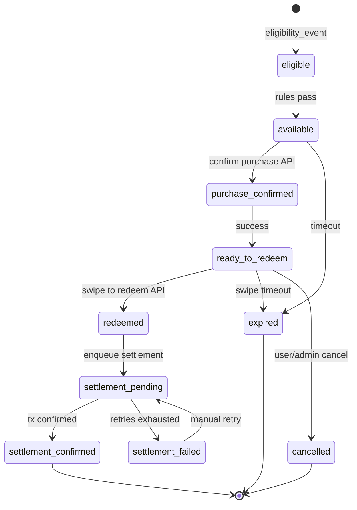
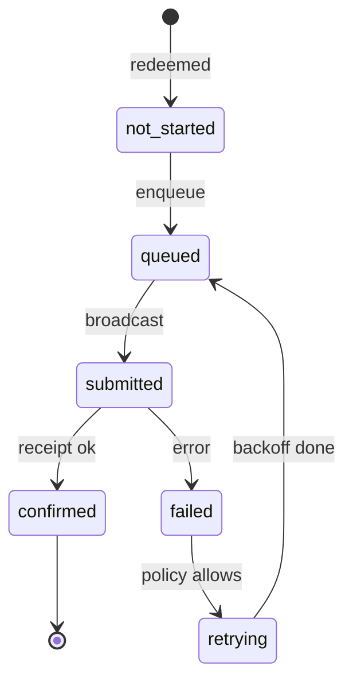

# Public Records Sponsored USDC Activation — Product Requirements Document

**Status:** Draft (implementation not started)  
**Pilot:** Public Records  
**Last updated:** 2026-05-20  
**Design:** [IRL Production — Sponsored activation UX (Figma)](https://www.figma.com/design/zIEzy0tYft7WdmNQkiLsTW/IRL-Production?node-id=2-106638&t=BWqUROj3XUIo7jHq-4)

**Related documentation**

- [IRL spend pilot technical PRD](../../plans/irl-spend-pilot-technical-prd.md) — user-wallet USDC spend rail (different custody model)
- [APP_OVERVIEW](../APP_OVERVIEW.md)
- [Stellar baselines and chain architecture](../stellar-baselines-and-chain-architecture.md)

---

## Summary

IRL will run a **sponsor-funded cultural activation** at Public Records where a **campaign wallet** is prefunded with USDC. Attendees **earn and redeem real-world perks** (e.g. drink credit) through familiar IRL flows—check-in, QR, confirm purchase, in-venue swipe—**without receiving, holding, or withdrawing USDC**.

On each completed in-venue redemption, the system records an **individual onchain USDC transfer** from the **campaign wallet** to a **venue settlement wallet** configured per activation. Settlement runs on **Base or Stellar** per activation config. Settlement may be **asynchronous**, but every transfer must remain **attributable to exactly one user redemption** so the **admin dashboard** can show **per-user transaction hashes** as proof of sponsor-funded spend.

**User-facing:** confirm purchase → success → swipe to redeem at venue (per Figma).  
**Backend:** sponsor USDC settlement to venue (no user custody).

---

## Background / context

### Problem

Partners and sponsors want **verifiable proof** that marketing dollars funded **real cultural attendance and venue spend**, not opaque off-chain redemptions. Users want **simple perks**, not crypto conversion UX.

### Existing IRL rails (distinction)

| Rail                              | User receives USDC?   | Onchain path                                  | Pilot relevance                           |
| --------------------------------- | --------------------- | --------------------------------------------- | ----------------------------------------- |
| Perks / rewards                   | No                    | None (codes/links)                            | UX reference for “redeem a perk”          |
| Spend pilot (`spend_experiences`) | Yes — embedded wallet | Treasury → user → receiving wallet            | **Out of scope** — opposite custody model |
| **This activation**               | **No**                | **Campaign wallet → venue settlement wallet** | **In scope**                              |

Privy remains the auth and identity layer (email/social; embedded wallet creation when needed for identity/rails). For this pilot, **embedded wallets are not USDC payout destinations**.

### Pilot sponsor narrative

Public Records + sponsor/IRL campaign wallet demonstrate **sponsor-funded cultural spend onchain** while the attendee experience stays **IRL-native**: check in, confirm perk, swipe to redeem at the bar.

### North star (explicitly deferred)

Long-term, user-controlled USDC wallets across many venues may be desirable. **This pilot does not send USDC to user wallets** and does not enable user withdrawal of campaign funds.

---

## Goals

1. **User experience:** Match authenticated Figma flow—confirm purchase, success, swipe to redeem, redeemed—without crypto conversion copy.
2. **Sponsor proof:** Each completed redemption produces (or queues) **one distinct onchain USDC transaction** with a **public tx hash** tied to that redemption.
3. **Custody:** Users **never** receive withdrawable USDC from the campaign wallet.
4. **Settlement path:** USDC moves **campaign wallet → venue settlement wallet** only.
5. **Multi-rail v1:** Admin selects **Base** or **Stellar** per activation; settlement and wallet validation follow that rail.
6. **Operations:** Admin configures activation, caps, wallets, rewards, eligibility; **admin-only** dashboard shows budget, settlements, and failures (**no CSV/export in v1**).
7. **Attribution:** Async settlement allowed; `redemption_id` links to at most one confirmed settlement tx.
8. **Auditability:** Backend reconstructs eligibility → redemption → settlement for support and reporting.

---

## Non-goals

- Sending USDC to **user** embedded or external wallets.
- User-visible USDC amounts, wallet addresses, or “pay with crypto” flows.
- **Batching** multiple redemptions into one onchain transfer.
- **Staff-facing app**, staff login, staff confirmation queues, or **payment confirmation** flows (deferred).
- **Admin CSV/export** of redemptions or settlements (deferred).
- Dedicated **sponsor/investor** portal or role (admin dashboard only in v1).
- Token-level spend restrictions, escrow contracts, or new smart contracts (unless separately approved).
- Multi-activation sponsor portfolios, automated invoicing, or tax reporting.
- Chains other than **Base** and **Stellar** in v1.

---

## User stories

| ID  | Story                                                                                                                       | Acceptance hint                                              |
| --- | --------------------------------------------------------------------------------------------------------------------------- | ------------------------------------------------------------ |
| U1  | As an attendee, I scan a checkpoint/activation QR and sign in so I can see my eligible perk.                                | Eligibility evaluated server-side after Privy auth.          |
| U2  | As an attendee, I see a **Confirm Your Purchase** screen with points to send and perk received (Figma), not crypto amounts. | Copy uses PTS + perk title; no USDC/wallet.                  |
| U3  | As an attendee, I tap **Confirm Purchase** and land on **Success** with balance/tier summary and swipe instructions.        | Points deducted (if configured) atomically with confirm.     |
| U4  | As an attendee, I **swipe to redeem** at the venue when ready; the control shows progress then **Redeemed**.                | Swipe is idempotent; second swipe blocked after `redeemed`.  |
| U5  | As an attendee, I cannot redeem twice when rules disallow it.                                                               | Server enforces per-user cap; UI shows prior redeemed state. |
| U6  | As an attendee, if my window expires before swipe, I see **Expired** or **Cancelled**.                                      | Terminal state with clear copy.                              |

---

## Admin stories

| ID  | Story                                                                                                                                                                | Acceptance hint                                              |
| --- | -------------------------------------------------------------------------------------------------------------------------------------------------------------------- | ------------------------------------------------------------ |
| A1  | As an admin, I create a **sponsored activation** with sponsor name, **settlement rail** (`base` \| `stellar`), campaign wallet, venue settlement wallet, and status. | Rail-specific address validation.                            |
| A2  | As an admin, I configure **reward item(s)** with display name, USDC settlement amount per redemption, and optional points cost.                                      | Points cost drives Confirm Purchase UI.                      |
| A3  | As an admin, I set **redemption cap** and/or **USDC budget cap**.                                                                                                    | Block new confirms when exceeded; dashboard shows remaining. |
| A4  | As an admin, I link **checkpoint / check-in / QR** eligibility rules.                                                                                                | Ineligible users cannot reach confirm purchase.              |
| A5  | As an admin, I view activation metrics, tx hash feed, failed/pending settlements, and per-redemption drilldown **in-app only**.                                      | No export button or API in v1.                               |
| A6  | As an admin, I can pause/end an activation (no new redemptions; in-flight settlement continues or fails visibly).                                                    | Status enforced on confirm/swipe APIs.                       |

---

## Authenticated user UX (Figma)

Reference: [Figma node 2-106638](https://www.figma.com/design/zIEzy0tYft7WdmNQkiLsTW/IRL-Production?node-id=2-106638&t=BWqUROj3XUIo7jHq-4).

### Screen sequence (v1)

| Step | Figma label                           | Purpose                                                                                                               | Backend trigger                                  |
| ---- | ------------------------------------- | --------------------------------------------------------------------------------------------------------------------- | ------------------------------------------------ |
| 1    | Signed in — **Confirm Your Purchase** | Hero image, “You receive: {reward}”, YOU SEND {points} PTS, YOU RECEIVE {reward title}, account email, current points | Eligibility satisfied; redemption in `available` |
| 2    | **Confirm Purchase** CTA              | User commits; points deducted if configured                                                                           | `purchase_confirmed` → `ready_to_redeem`         |
| 3    | **Success!**                          | YOU SPENT, balance, tier; **How to collect** copy                                                                     | Read-only receipt state                          |
| 4    | **Swipe to redeem**                   | Slider CTA; copy: show screen at event; swipe only when ready                                                         | Client gesture → `redeemed` API                  |
| 5    | **Redeemed**                          | Green “REDEEMED” terminus; prior summary remains                                                                      | Triggers settlement queue                        |

### UX requirements

- **FR-UX-1** Primary surfaces use **points and perk titles** only; never show USDC, chain, or tx hash to users.
- **FR-UX-2** Swipe control must be **hard to complete accidentally** (slider, not single tap).
- **FR-UX-3** Post-redeem screen is **read-only**; no second swipe path.
- **FR-UX-4** Mobile-first layout per Figma (hero 4:5 asset, sticky bottom CTA).
- **FR-UX-5** “How to collect” instructs patron to **show phone at venue**; no staff app implied.

### Out of UX scope (v1)

- Staff confirmation UI, staff PIN, or “confirm payment” modals.
- Wallet connect or chain picker on user path (rail is activation-level).

---

## Functional requirements

### FR-1 Activation lifecycle

- **FR-1.1** Admin creates/updates activation in `draft`; only `active` accepts eligibility, confirm, and swipe within window.
- **FR-1.2** Activation stores: sponsor name, `settlement_rail` (`base` \| `stellar`), campaign wallet, venue settlement wallet, token/asset identifiers for rail, caps, eligibility config, status, window.
- **FR-1.3** Ending activation blocks new confirms/swipes; existing `settlement_pending` continues.

### FR-2 Settlement rails (Base + Stellar)

- **FR-2.1** Each activation has exactly one `settlement_rail` for v1.
- **FR-2.2** **Base:** EVM addresses, Base USDC contract, Privy server wallet signing (reuse spend-rail Base patterns).
- **FR-2.3** **Stellar:** Stellar G-addresses, USDC asset (issuer from env/config), Privy Stellar server wallet or documented signer (reuse `lib/privy/stellar-rail-wallet.ts` and treasury patterns where applicable).
- **FR-2.4** Campaign and venue wallets must match the activation rail; cross-rail addresses rejected at config time.
- **FR-2.5** Explorer links in admin dashboard are rail-aware (Base block explorer vs Stellar Expert).

### FR-3 Eligibility

- **FR-3.1** Privy auth required before confirm purchase.
- **FR-3.2** Record **eligibility event** (checkpoint check-in, location check-in, QR scan, ticket scan, NFC—**not** staff grant in v1) before `available`.
- **FR-3.3** Configurable rules: max per user per activation, daily limits, required checkpoint ids.
- **FR-3.4** Deep link/QR validated server-side (signed token if aligned with checkpoint patterns).

### FR-4 Redemption (user-only, no staff)

- **FR-4.1** `available` → user opens Confirm Purchase.
- **FR-4.2** **Confirm Purchase** atomically: validate points (if `points_cost > 0`), create/update redemption `purchase_confirmed`, deduct points, transition to `ready_to_redeem`.
- **FR-4.3** **Swipe to redeem** transitions `ready_to_redeem` → `redeemed`; idempotent if already `redeemed`.
- **FR-4.4** No `pending_staff_confirmation`, staff APIs, or payment-confirmation step in v1.
- **FR-4.5** One redemption → one reward item → one settlement chain.
- **FR-4.6** User copy excludes USDC, wallets, and conversion language.

### FR-5 Settlement (backend)

- **FR-5.1** On `redeemed`, create settlement `not_started` → `queued`.
- **FR-5.2** Transfer `usdc_amount_snapshot` from campaign wallet → venue settlement wallet on activation rail.
- **FR-5.3** **No** transfer to user wallet addresses (assert at build time).
- **FR-5.4** One redemption → one onchain transfer (no batching).
- **FR-5.5** On confirm: redemption `settlement_confirmed`, persist `tx_hash` / Stellar tx id, rail metadata.
- **FR-5.6** Async worker allowed; redemption may show `settlement_pending` while user UI stays **Redeemed**.
- **FR-5.7** Insufficient campaign balance → `settlement_failed`, admin alert; user UI unchanged.

### FR-6 Budget and caps

- **FR-6.1** `max_redemptions` and/or `max_usdc_budget`.
- **FR-6.2** Reserve budget on `redeemed`; release on `cancelled` before submit; finalize on `settlement_confirmed`.
- **FR-6.3** Block new confirm when cap exceeded.

### FR-7 Wallets and signing

- **FR-7.1** Campaign wallet = IRL-controlled server wallet per rail.
- **FR-7.2** Venue wallet = admin-configured receive address per rail.
- **FR-7.3** Server-side signing only.

### FR-8 Idempotency

- **FR-8.1** Idempotency key: `activation_id + user_id + reward_item_id` (or include eligibility id if multiple rewards per activation).
- **FR-8.2** Duplicate confirm/swipe/settlement worker calls must not double-deduct points or double-transfer.
- **FR-8.3** Unique constraint: one `confirmed` settlement per `redemption_id`.

### FR-9 Admin dashboard (no export)

- **FR-9.1** In-app metrics, feeds, drilldowns only—**no** CSV download, bulk export API, or Metabase requirement in v1.
- **FR-9.2** Manual settlement retry trigger allowed for admins (ops).

### FR-10 Integration

- Reuse Privy auth, players/points, checkpoints, admin auth, API response helpers, Mixpanel, Base USDC + Stellar spend-rail wallet utilities.
- **New tables**; do not overload `spend_redemptions`.

---

## Data model / key entities

### `sponsored_activation`

| Field                             | Type        | Notes                                          |
| --------------------------------- | ----------- | ---------------------------------------------- |
| `id`                              | uuid        | PK                                             |
| `slug`                            | text        | e.g. `public-records-2026`                     |
| `title`                           | text        | Display                                        |
| `sponsor_name`                    | text        |                                                |
| `event_id`                        | uuid?       |                                                |
| `status`                          | enum        | `draft`, `active`, `paused`, `ended`           |
| `settlement_rail`                 | enum        | **`base`**, **`stellar`** (required v1)        |
| `campaign_wallet_address`         | text        | Rail-specific                                  |
| `venue_settlement_wallet_address` | text        | Rail-specific                                  |
| `usdc_asset_config`               | jsonb       | Base: contract address; Stellar: code + issuer |
| `max_redemptions`                 | int?        |                                                |
| `max_usdc_budget`                 | numeric?    |                                                |
| `usdc_settled_total`              | numeric     |                                                |
| `redemption_count_confirmed`      | int         |                                                |
| `starts_at` / `ends_at`           | timestamptz |                                                |
| `eligibility_config`              | jsonb       |                                                |
| `created_by`                      | text        |                                                |
| `created_at` / `updated_at`       | timestamptz |                                                |

### `activation_reward_item`

| Field            | Type    | Notes                               |
| ---------------- | ------- | ----------------------------------- |
| `id`             | uuid    | PK                                  |
| `activation_id`  | uuid    | FK                                  |
| `name`           | text    | Figma “Title of Item 1”             |
| `hero_image_url` | text?   | Figma hero                          |
| `description`    | text?   |                                     |
| `points_cost`    | int     | Figma “YOU SEND” (0 = no deduction) |
| `usdc_amount`    | numeric | Settlement amount (backend only)    |
| `sort_order`     | int     |                                     |
| `is_active`      | bool    |                                     |
| `max_per_user`   | int?    | Default 1                           |

### `activation_eligibility_event`

| Field            | Type        | Notes                                                                                                  |
| ---------------- | ----------- | ------------------------------------------------------------------------------------------------------ |
| `id`             | uuid        | PK                                                                                                     |
| `activation_id`  | uuid        | FK                                                                                                     |
| `user_id`        | uuid        |                                                                                                        |
| `wallet_address` | text?       | Identity only                                                                                          |
| `source`         | enum        | `checkpoint_checkin`, `location_checkin`, `qr_scan`, `nfc`, `ticket_scan` (**no `staff_grant` in v1**) |
| `source_ref_id`  | text?       |                                                                                                        |
| `occurred_at`    | timestamptz |                                                                                                        |
| `metadata`       | jsonb       |                                                                                                        |

### `activation_redemption`

| Field                       | Type         | Notes               |
| --------------------------- | ------------ | ------------------- |
| `id`                        | uuid         | PK                  |
| `activation_id`             | uuid         | FK                  |
| `reward_item_id`            | uuid         | FK                  |
| `user_id`                   | uuid         | FK                  |
| `eligibility_event_id`      | uuid         | FK                  |
| `status`                    | enum         | See state machine   |
| `points_spent`              | int?         | Snapshot at confirm |
| `usdc_amount_snapshot`      | numeric      | At confirm          |
| `purchase_confirmed_at`     | timestamptz? |                     |
| `redeemed_at`               | timestamptz? | Swipe completed     |
| `cancelled_reason`          | text?        |                     |
| `idempotency_key`           | text         | Unique              |
| `created_at` / `updated_at` | timestamptz  |                     |

**Removed from v1:** `staff_confirmed_by`, `staff_confirmed_at`.

### `activation_settlement_transaction`

| Field                                         | Type         | Notes                     |
| --------------------------------------------- | ------------ | ------------------------- |
| `id`                                          | uuid         | PK                        |
| `redemption_id`                               | uuid         | FK                        |
| `activation_id`                               | uuid         | FK                        |
| `settlement_rail`                             | enum         | Copy from activation      |
| `status`                                      | enum         | Settlement SM             |
| `amount`                                      | numeric      |                           |
| `from_wallet_address`                         | text         |                           |
| `to_wallet_address`                           | text         |                           |
| `tx_hash`                                     | text?        | EVM hash or Stellar tx id |
| `submission_attempt`                          | int          |                           |
| `last_error_code`                             | text?        |                           |
| `queued_at` / `submitted_at` / `confirmed_at` | timestamptz? |                           |
| `privy_transaction_id`                        | text?        | If applicable             |

---

## Event / admin configuration requirements

| Config                                    | Required       | Validation                               |
| ----------------------------------------- | -------------- | ---------------------------------------- |
| Sponsor / campaign name                   | Yes            | Non-empty                                |
| **Settlement rail**                       | Yes            | `base` or `stellar`                      |
| Campaign wallet                           | Yes            | EVM checksum (Base) or Stellar G-address |
| Venue settlement wallet                   | Yes            | Same rail; ≠ campaign                    |
| USDC asset config                         | Yes            | Rail-specific schema                     |
| Reward name, `points_cost`, `usdc_amount` | Yes (≥1)       | `usdc_amount > 0`; `points_cost >= 0`    |
| Redemption cap and/or USDC budget         | Yes (one+)     | Positive                                 |
| Activation window                         | Yes            | `ends_at > starts_at`                    |
| Checkpoint(s) / event id                  | Yes (PR pilot) | Exists in DB                             |
| Eligibility rules JSON                    | Yes            | Zod                                      |
| Status                                    | Yes            | `active` for user flows                  |

**Removed from v1 config:** `staff_confirmation_required`, payment confirmation toggles.

**Public Records defaults:** one drink reward, one redemption per user, prefunded campaign wallet before `active`, rail chosen per ops (Base or Stellar).

---

## Redemption state machine

### States

| State                  | Description                  | User UI (Figma)                 |
| ---------------------- | ---------------------------- | ------------------------------- |
| `eligible`             | Eligibility recorded         | Pre-confirm or hidden           |
| `available`            | Can open Confirm Purchase    | Confirm Your Purchase           |
| `purchase_confirmed`   | Points committed (if any)    | Transitional (optional loading) |
| `ready_to_redeem`      | Awaiting in-venue swipe      | Success + Swipe to redeem       |
| `redeemed`             | Swipe completed              | Redeemed                        |
| `settlement_pending`   | Onchain in flight            | Redeemed (unchanged)            |
| `settlement_confirmed` | Tx confirmed                 | Redeemed                        |
| `settlement_failed`    | Settlement exhausted retries | Redeemed (user); ops alert      |
| `cancelled`            | Voided before swipe          | Cancelled message               |
| `expired`              | Window/hold expired          | Expired message                 |

**Not in v1:** `pending_staff_confirmation`.

### Transitions

### Invariants

- Settlement states only after `redeemed`.
- `settlement_confirmed` ⇒ exactly one `tx_hash` on settlement row.
- Swipe cannot occur before `ready_to_redeem`.

---

## Settlement state machine

(Unchanged structure; rail-aware execution.)

| State         | Description                       |
| ------------- | --------------------------------- |
| `not_started` | Created at `redeemed`             |
| `queued`      | Worker picked up; budget reserved |
| `submitted`   | Broadcast                         |
| `confirmed`   | Onchain success                   |
| `failed`      | Attempt failed                    |
| `retrying`    | Backoff                           |

| Settlement status                                | Redemption status      |
| ------------------------------------------------ | ---------------------- |
| `not_started`, `queued`, `submitted`, `retrying` | `settlement_pending`   |
| `confirmed`                                      | `settlement_confirmed` |
| `failed` (exhausted)                             | `settlement_failed`    |

---

## Dashboard requirements (admin only, no export)

### Aggregate tiles

| Metric                | Definition                               |
| --------------------- | ---------------------------------------- |
| Check-ins verified    | Count `activation_eligibility_event`     |
| Redemptions created   | Redemptions past `available`             |
| Redemptions confirmed | `redeemed` + settlement states           |
| USDC settled          | Sum confirmed settlement `amount`        |
| Budget remaining      | `max_usdc_budget - settled - reserved`   |
| Redemptions remaining | `max_redemptions - confirmed count`      |
| Settlement rail       | Display `settlement_rail` for activation |

### Transaction hash feed

- One row per **confirmed** settlement; explorer link per rail.
- No batched multi-user txs.

### Failed / pending list

- Filter `queued`, `submitted`, `retrying`, `failed`.
- Admin manual retry (no export).

### Per-redemption drilldown

- User id/username, reward, points spent, redemption timeline, settlement status, `tx_hash`, eligibility source.

### Access control

- **Admin only** in v1 (no sponsor role, no export).

---

## Error and retry behavior

| Error                      | User impact                    | System behavior            |
| -------------------------- | ------------------------------ | -------------------------- |
| Activation inactive        | Cannot confirm                 | 4xx                        |
| Insufficient points        | Cannot confirm                 | 4xx on confirm             |
| Cap / budget exceeded      | “No longer available”          | Block confirm              |
| Duplicate confirm          | Show existing success/redeemed | Idempotent read            |
| Duplicate swipe            | Stay redeemed                  | Idempotent                 |
| Campaign insufficient USDC | None on user UI                | `settlement_failed`, retry |
| RPC / Horizon timeout      | None                           | Poll + retry               |
| Wrong rail signer          | None                           | Fail fast at config        |

### Retry policy

- Max **5** attempts / **24h**, exponential backoff (30s → 2h).
- No duplicate confirmed tx per `redemption_id`.

### User messaging

- No raw chain errors or addresses in attendee UI.

---

## Security / abuse prevention

- Server-side validation for eligibility, confirm, swipe, settlement.
- Privy auth on user endpoints; admin auth on admin routes.
- Rate limits on confirm and swipe.
- Swipe requires authenticated session + redemption in `ready_to_redeem` (optional: short-lived server nonce after confirm).
- Settlement `to` ≠ user wallets on either rail.
- Budget reserve at `redeemed`.
- **Removed v1:** staff auth, staff PIN, payment confirmation gates.

---

## Analytics events

Properties: `activation_id`, `settlement_rail`, `user_id`, `reward_item_id`, `redemption_id`, `settlement_id`, `status`, `points_spent`; `usdc_amount` **server-side only**.

| Event                                         | When                         |
| --------------------------------------------- | ---------------------------- |
| `sponsored_activation_viewed`                 | Activation surface opened    |
| `sponsored_activation_eligibility_recorded`   | Eligibility persisted        |
| `sponsored_redemption_confirm_viewed`         | Confirm Purchase screen      |
| `sponsored_redemption_purchase_confirmed`     | Confirm CTA success          |
| `sponsored_redemption_swipe_started`          | Swipe gesture started        |
| `sponsored_redemption_redeemed`               | Swipe completed → `redeemed` |
| `sponsored_redemption_cancelled`              | Cancelled                    |
| `sponsored_redemption_expired`                | Expired                      |
| `sponsored_settlement_queued`                 | Settlement queued            |
| `sponsored_settlement_submitted`              | Broadcast                    |
| `sponsored_settlement_confirmed`              | Confirmed                    |
| `sponsored_settlement_failed`                 | Failed                       |
| `sponsored_activation_cap_reached`            | Cap hit                      |
| `sponsored_activation_admin_dashboard_viewed` | Admin dashboard              |

**Removed v1:** `sponsored_redemption_pending_staff`, `sponsored_redemption_staff_confirmed`, sponsor-viewer events.

---

## Open questions

| #    | Question                                                              | Owner       | Blocks         |
| ---- | --------------------------------------------------------------------- | ----------- | -------------- |
| OQ-1 | USDC amount per drink (Base vs Stellar same nominal?)                 | Sponsor/Ops | Config         |
| OQ-2 | Points cost for Public Records confirm (99 PTS placeholder in Figma?) | Product     | Reward config  |
| OQ-3 | Swipe timeout duration before `expired`                               | Product     | State machine  |
| OQ-4 | Campaign wallet per rail: shared treasury vs dedicated PR wallets     | Eng/Ops     | Runbook        |
| OQ-5 | Auto-pause activation on insufficient campaign USDC                   | Product     | Ops            |
| OQ-6 | Public Records checkpoint id(s) and ticket integration                | Ops         | Eligibility    |
| OQ-7 | Stellar USDC issuer for production settlement                         | Eng         | Stellar config |
| OQ-8 | Legal copy for sponsor-funded venue settlement                        | Legal       | Terms only     |
| OQ-9 | Manual settlement retry permissions                                   | Eng         | Admin UI       |

**Closed for v1 (deferred):** staff auth, payment confirmation, CSV export, sponsor portal.

---

## Acceptance criteria

### Configuration

- [ ] Admin creates activation with `settlement_rail` `base` or `stellar`, valid wallets, rewards, caps, window.
- [ ] Cross-rail wallet addresses rejected.

### User flow (Figma)

- [ ] User sees Confirm Purchase with points + perk only (no USDC).
- [ ] Confirm → Success → Swipe → Redeemed matches Figma states.
- [ ] Second swipe blocked after redeemed.
- [ ] Per-user redemption limits enforced.

### Settlement

- [ ] `redeemed` enqueues settlement on correct rail.
- [ ] Transfer is campaign → venue only; never to user wallet.
- [ ] One confirmed `tx_hash` per redemption; no batching.
- [ ] Retries do not duplicate confirmed transfers.

### Admin dashboard

- [ ] Tiles and feeds match DB; drilldown complete.
- [ ] **No** export/download in UI or API.

### Non-functional

- [ ] Mixpanel events for confirm, swipe, settlement.
- [ ] Failed settlements visible in admin pending/failed list.

---

## Out of scope / future work

- **Staff app**, staff confirmation, payment confirmation at POS.
- **Admin export** (CSV, bulk API).
- **Sponsor/investor** read-only portal (admin dashboard suffices for v1).
- User-controlled USDC wallets (spend pilot model).
- Batched settlement.
- Chains beyond Base and Stellar.
- Smart contract escrows.

---

## Implementation notes (for engineers / agents)

1. Migrations for entities above; `settlement_rail` on activation + settlement rows.
2. Zod schemas with discriminated wallet validation (`base` vs `stellar`).
3. Atomic **confirm purchase** (points + redemption state) and **swipe redeem** (→ `redeemed` + enqueue).
4. Rail-specific settlement workers (Base viem/Privy; Stellar Horizon/Privy).
5. User routes + admin routes; UI from Figma node linked above.
6. **Do not** implement staff or export surfaces in v1.

**Reuse:** `lib/privy/stellar-rail-wallet.ts`, Base spend-rail treasury code; **do not** reuse user USDC funding paths.

---

## Document history

| Version | Date       | Author | Notes                                                                         |
| ------- | ---------- | ------ | ----------------------------------------------------------------------------- |
| 0.1     | 2026-05-20 | Agent  | Initial PRD                                                                   |
| 0.2     | 2026-05-20 | Agent  | Base+Stellar v1; Figma swipe UX; removed staff/sponsor/export/payment confirm |
