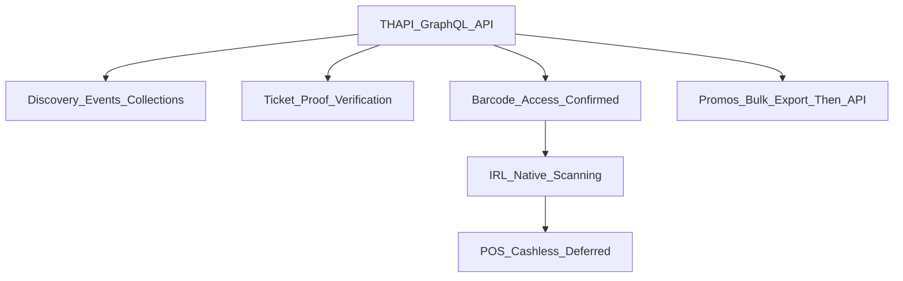

# feat: DICE/Fever Partnership Implementation (Operational + Technical Plan)

## Context (Jan 2026 operational call)

This plan reflects the operational partnership discussion between IRL and DICE/Fever, focused on **implementation details** beyond legal documentation:

- **API access** for: ticket + scan data, venue check-ins, event discovery (Collections + event listing), and discount promotions.
- **In-venue purchases (POS)** + potential **Fever cashless** integration was identified as the **hardest / highest-risk** track and should be scoped after core foundations ship.
- The team outlined **experiments** (Standard Time, Public Records, Space) and **next steps** for both parties.

### Technical Confirmation (Post-Call)

DICE's **Ticket Holders API (THAPI)** has been confirmed to support the technical requirements:

- **API Endpoint**: `https://partners-endpoint.dice.fm/graphql` (GraphQL)
- **Authentication**: MIO-managed Bearer tokens (DICE's internal back office)
- **Confirmed capabilities**: events, orders, ticket holders, tickets, and **barcodes**
- Barcodes can be exposed to partners and queried via the API, enabling IRL-native scanning workflows

## Goals

- **Discovery**: browse/curate events via DICE **Collections** + broader **event listing API** access (not only “refractions events”).
- **IRL check-ins at events/venues**: map DICE events to IRL locations/checkpoints, with clear curation + visibility controls.
- **Ticket proof**: verify ticket ownership during check-in (and/or integrate scanning).
- **Scanning**: enable IRL-controlled scanning workflow if barcode data is available; otherwise ingest scan outcomes.
- **Promotions**: support discounts/promos with attribution (ideally automated promo-code generation).
- **POS/cashless (deferred)**: design a path to award points for in-venue purchases via Fever cashless or partner POS.

## Non-goals (explicitly deferred)

- Building a full in-app ticket checkout if the partnership only supports deep links.
- Shipping POS/cashless before discovery + ticket proof/scanning foundations are stable.

## Blockers (known)

1. **POS/cashless complexity**: time-intensive; requires separate Fever cashless team + possible changes to existing POS systems.
2. **Event listing scope**: currently limited to **“refractions events only”**, which blocks broad curation.
3. **Event listing scope**: currently limited to **"refractions events only"**, which blocks broad curation. (DICE side following up internally on expansion timeline.)

**Resolved**: Barcode availability is confirmed — ticket barcodes can be accessed via THAPI GraphQL API (`code` field on `Ticket` type), enabling IRL-native scanning workflows.

## Next steps (from the call)

### IRL

- Caitlin will examine the **volume of DICE events** across cities to inform curation strategy.
- Malcolm will identify **3 test cases** for POS experiments: **Standard Time**, **Public Records**, **Space**.
- IRL should prioritize running event tickets on **IRL’s own system** to maintain control and benefit from kickbacks.
- Continue partnerships with **Bridge**, **Privy**, **Stripe** for crypto-to-fiat rails.

### DICE/Fever

- Simon will investigate whether **ticket barcodes** can be made available via API so IRL can integrate scanning in-app.
- Simon + Dave will discuss expanding IRL’s access to the **event listing API** beyond only “refractions events”.
- Provide an **account manager** to Caitlin to guide best practices for onboarding promoters/venues to DICE.
- Maya will involve the **Fever cashless** team to scope POS integration once foundations are in place.
- Continue exploring an API for **automated promo code generation**.

## Architecture (server-first, credential-safe)

- **All DICE/Fever requests are server-side only** (Next.js Route Handlers / server actions). Never ship partner keys to clients.
- Use **Zod** at boundaries (query/body validation and upstream response validation).
- Prefer **feature flags** for capability-dependent areas (orders, checkout, scanning, promos).

## THAPI Integration Details

DICE's Ticket Holders API (THAPI) is a GraphQL API accessible at `https://partners-endpoint.dice.fm/graphql`.

### Authentication

- Bearer token authentication via MIO-managed API tokens (DICE's internal back office)
- Tokens are provisioned per partner account

### Key GraphQL Queries

**Fetch tickets for an event**:

```graphql
query GetEventTickets($eventId: ID!) {
  node(id: $eventId) {
    ... on Event {
      id
      name
      startDatetime
      tickets(first: 50) {
        edges {
          node {
            id
            code # QR code (barcode)
            ticketType {
              id
              name
              description
            }
            holder {
              id
              firstName
              lastName
              email
              phoneNumber
            }
            claimedAt
          }
        }
        pageInfo {
          hasNextPage
          endCursor
        }
      }
    }
  }
}
```

**Query tickets by fan phone number**:

```graphql
query GetTicketsByPhone($phoneNumber: String!) {
  viewer {
    tickets(first: 50, where: { fanPhoneNumber: { eq: $phoneNumber } }) {
      edges {
        node {
          id
          code
          ticketType {
            name
          }
          holder {
            email
            phoneNumber
          }
        }
      }
    }
  }
}
```

**Query orders with purchase date filter**:

```graphql
query GetOrders($purchasedAfter: Datetime!) {
  viewer {
    orders(first: 50, where: { purchasedAt: { gte: $purchasedAfter } }) {
      edges {
        node {
          id
          purchasedAt
          tickets {
            code
            holder {
              email
              phoneNumber
            }
          }
        }
      }
    }
  }
}
```

### Implementation Notes

- All queries should be executed server-side only (Next.js API routes or server actions)
- Use cursor-based pagination (`first`/`after`) for large result sets
- Cache responses appropriately (revalidate) to respect rate limits
- Handle GraphQL errors gracefully (authentication, rate limits, schema drift)



## Workstreams + phases (incremental)

### Phase 0 — Capability confirmation + operational alignment (parallel, week 0)

Deliverable: a written “capabilities matrix” answering the open questions below (barcode/scans, listing scope, promos, identity model).

- Confirm event listing access scope (refractions-only vs broader) and whether **Collections** are available.
- Confirm whether IRL can access:
  - **Ticket barcodes** (format/spec/rotation) OR
  - **Scan results** (API/webhook/export), and required fields.
- Confirm promo-code generation API feasibility.
- Identify the correct identity key(s): email, phone, DICE user id, order id, ticket id.

### Phase 1 — Discovery (Collections + listing API) (week 1)

Deliverable: IRL can browse a broader event set (within allowed scope) and/or curated collections.

- Add server-only DICE clients + schemas under `lib/dice/` (or `lib/dice.ts` if you prefer a single file).\n - REST: events listing, collections, event details.\n - Typed upstream error handling: auth, 429/rate-limit, schema drift.\n- Add `app/api/dice/*` endpoints:\n - `GET /api/dice/events` with filters (city, date range, tags/genres, pagination).\n - `GET /api/dice/collections` and/or `GET /api/dice/collections/[id]` (if supported).\n - `GET /api/dice/events/[id]` (details).\n- Add RSC-first UI pages (e.g. `app/events/*`) to browse DICE events/collections.\n- Cache discovery responses (revalidate) and provide friendly errors on rate limits.

### Phase 2 — IRL curation + optional DB sync (week 1–2)

Deliverable: curated set of DICE events appear as IRL “checkable” locations (with controls).

Two viable approaches (choose per ops needs):

- **Option A (DB sync + curation)**: periodic sync into Supabase `locations` (good for fast UX and operational curation).\n - Keep minimal DICE columns: `dice_event_id`, `dice_event_state`, `dice_start_time`, `dice_end_time`.\n - Use a cron route `/api/dice/sync` to upsert.\n- **Option B (no DB sync)**: discovery-only, check-in targets are created manually/curated in IRL.\n
  Recommendation: start with **Option A** if IRL wants operational control and fast map browsing.

### Phase 3 — Ticket proof at check-in (week 2)

Deliverable: ticket-gated check-in for DICE events.

- Integrate DICE Partners GraphQL (ticket holders) server-side.\n- Add a minimal identity link:\n - Store `players.dice_linked_email` (or other agreed identifier).\n- At check-in time, if `location.dice_event_id` exists:\n - Verify ticket holder.\n - Return clear errors for “not linked” and “no ticket”.

### Phase 4 — Scanning integration (week 2–3)

Deliverable: robust in-venue validation + anti-fraud.

Two modes:

- **Mode A (preferred)**: IRL app performs scanning.\n - Requires: **barcode availability** + format/spec + rotation/expiry behavior.\n - IRL validates scan server-side and awards points.\n- **Mode B (fallback)**: scanning stays in DICE/Fever tools.\n - IRL consumes **scan events** (API/webhook/export), dedupes, and awards points.\n
  Key product choices:
- How to handle re-entry scans, partial scans, offline mode, and refunds/chargebacks.\n- How scan proof maps to “one check-in per user per event”.

### Phase 5 — Promotions / discounts (week 3)

Deliverable: trackable discount campaigns.

Two-phase approach (confirmed alignment):

- **Short term**: bulk promo code exports (manual operational process)
  - DICE provides promo codes via export
  - IRL tracks redemptions and attribution manually
- **Longer term**: potential API automation (to be explored)
  - Generate codes programmatically per campaign/partner
  - Constraints: expiry, max uses, eligible events
  - Reporting fields to attribute redemptions to IRL

### Phase 6 — POS / Fever cashless integration (deferred; highest risk)

Deliverable: points awarded for in-venue purchases.

Principle: **do not start build** until (a) foundations ship and (b) Fever cashless team confirms integration shape.

Pilot experiments (from call):

- **Standard Time**\n- **Public Records**\n- **Space**\n
  Minimum data contract (what IRL needs, regardless of vendor):
- purchase id, venue id, timestamp\n- user identifier mapping (cashless user id ↔ IRL user)\n- line items or totals (including tax/tip) and currency\n- refunds/voids/chargebacks and how they should affect points\n- idempotency guarantees + replay window\n
  Operational decisions required:
- whether points are awarded per purchase, per category, or per spend tier\n- how “guest checkout” is handled (no user identity)\n- privacy constraints and data retention

## Clarifying questions (use in partner follow-ups)

### A) Discovery (Collections + listing API)

- What is the **full scope** of events IRL can access (refractions-only vs broader)? What’s the timeline to expand?\n- Do you support **Collections** APIs? What are the collection types and how are they curated?\n- What filters are available: city/geo radius, date range, genre/tags, venue, promoter?\n- Pagination model: cursor vs page/limit. Stable ordering guarantees?\n- What media fields are available (hero image, thumbnails, lineup/artist images)?\n- Rate limits (per minute/hour) and recommended caching strategy.\n- Do events include accurate venue coordinates, or must IRL geocode?\n

### B) Ticket proof (ticket holders / orders)

- What identifiers can we query by: **email**, phone, DICE user id, order id?\n- Are there privacy constraints around fan emails (hashing, consent requirements)?\n- Can ticket holder APIs filter without pagination (or do we need to page)?\n- What constitutes a “valid ticket” (status values; transferred tickets; cancellations)?\n- Can IRL retrieve a stable ticket id/order id for audit logs?\n

### C) Scanning / barcodes / scan data

**Mostly answered**:

- ✅ **Barcodes ARE available via API**: THAPI `Ticket` type exposes `code` field (QR code/barcode)
- ✅ Can query tickets with barcodes via THAPI GraphQL API

**Still need**:

- Barcode type (QR/PDF417/etc), payload format, rotation/expiry behavior, and anti-forgery requirements?
- How are re-entry scans represented?
- How do refunds/chargebacks affect scan validity?
- What is the recommended dedupe/idempotency key?\n

### D) Promotions / discounting

**Partially answered**:

- ✅ **Short term**: bulk promo code exports confirmed (manual operational process)
- ✅ **Longer term**: potential API automation to be explored

**Still need**:

- When will automated promo code generation API be available?
- Constraints supported: per-event, per-collection, per-venue, start/end time, max uses, min spend?
- What reporting is available (redemptions, revenue impact, attribution to IRL)?\n

### E) POS / Fever cashless (the hard track)

- What integrations are feasible today: Fever cashless only, or external POS too?\n- What is the purchase event schema and how do we map it to IRL identities?\n- Is there a “cashless user id” we can link to an IRL user at onboarding?\n- Latency expectations: real-time vs batch.\n- How are refunds/voids communicated and when should points be reversed?\n- What is the minimum viable pilot we can run at Standard Time / Public Records / Space?\n

### F) Security, compliance, and operations

- Key management: how are API keys provisioned/rotated? Separate keys per environment?\n- Audit logging expectations (what we must store for disputes).\n- SLAs and support process (account manager escalation path).\n

## Success criteria (definition of “working”)

- IRL can browse events/collections within allowed scope and curate what appears.\n- Ticket-gated check-in works reliably for DICE events.\n- Scanning path is decided (barcode vs scan events) and implemented for at least one pilot.\n- Promo mechanism exists (API or manual) with clear attribution.\n- POS/cashless is scoped with a written data contract and a concrete pilot plan.
