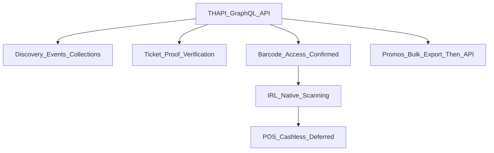

# DICE Implementation Plan

## Context (Jan 2026 operational call)

This plan reflects the operational partnership discussion between IRL and DICE/Fever:

- **API access** for: ticket + scan data, venue check-ins, event discovery (Collections + event listing), and discount promotions.
- **In-venue purchases (POS)** + potential **Fever cashless** integration was identified as the **hardest / highest-risk** track and should be scoped after core foundations ship.
- The team outlined **experiments** (Standard Time, Public Records, Space) and **next steps** for both parties.

### Technical Details

DICE's **Ticket Holders API (THAPI)** has been confirmed to support these technical requirements:

- **API Endpoint**: `https://partners-endpoint.dice.fm/graphql` (GraphQL)
- **Authentication**: MIO-managed Bearer tokens (DICE's internal back office)
- **Confirmed capabilities**: events, orders, ticket holders, tickets, and **barcodes**
- Barcodes can be exposed to partners and queried via the API, enabling IRL-native scanning workflows

## Capabilities matrix (source-of-truth)

### Confirmed

- **THAPI endpoint**: `https://partners-endpoint.dice.fm/graphql` (GraphQL)
- **Auth**: Bearer token (server-side only)
- **Entities**: events, orders, tickets, ticket holders
- **Barcode access**: `Ticket.code`

### Unknown / needs confirmation

- **Discovery API**: endpoint(s), protocol (REST vs GraphQL), schema, auth, rate limits
- **Scan outcomes**: whether scan events/outcomes are available (webhook vs polling vs export)
- **Ticket validity**: status enum(s), transfers, cancellations, refunds/chargebacks semantics
- **Barcode behavior**: format (QR/PDF417/etc), payload/rotation/expiry, anti-forgery guidance

## APIs in scope (server-only)

- **THAPI (confirmed)**: used for ticket proof + barcode-driven workflows.
- **Discovery (to confirm)**: Collections + event listing (treat as a separate API surface from THAPI until DICE confirms otherwise).

## Goals

- **Discovery**: browse/curate events via DICE **Collections** + broader **event listing API** access (not only “refractions events”).
- **IRL check-ins at events/venues**: map DICE events to IRL locations/checkpoints, with clear curation + visibility controls.
- **Ticket proof**: verify ticket ownership during check-in (and/or integrate scanning).
- **Scanning**: enable IRL-controlled scanning workflow if barcode data is available; otherwise ingest scan outcomes.
- **Promotions**: support discounts/promos with attribution (ideally automated promo-code generation).
- **POS/cashless (deferred)**: design a path to award points for in-venue purchases via Fever cashless or partner POS.

## Non-goals (explicitly deferred)

- Building a full in-app ticket checkout if the partnership only supports deep links.
- Shipping POS/cashless before discovery + ticket proof/scanning foundations are stable.

## Blockers

1. **POS/cashless complexity**: time-intensive; requires separate Fever cashless team + possible changes to existing POS systems.
2. **Event listing scope**: currently limited to **"refractions events only"**, which blocks broad curation. (DICE side following up internally on expansion timeline.)

**Resolved**: Barcode availability is confirmed — ticket barcodes can be accessed via THAPI GraphQL API (`code` field on `Ticket` type), enabling IRL-native scanning workflows.

## What Was Aligned (Post-Call Confirmation)

Operational alignment confirmed:

- **Ticketing + scans → IRL rewards**: IRL will build against DICE APIs to ingest real-time purchase + scan data and award points.
- **Account linking**: email/phone as the primary key, with edge cases (e.g., Sign in with Apple) handled during implementation.
- **Event discovery**: curated discovery can be supported via DICE Collections and/or the event listing API.
- **Promos**: supported short term via bulk promo code exports, with potential API automation longer term.
- **POS**: agreed this is the most complex piece — ticketing and check-ins come first, with POS/cashless scoped in parallel and rolled out post-initial pilots.

## Architecture (server-first, credential-safe)

- **All DICE/Fever requests are server-side only** (Next.js Route Handlers / server actions). Never ship partner keys to clients.
- Use **Zod** at boundaries (query/body validation and upstream response validation).

## Data contracts (what we must define before awarding points)

### Identity linking (IRL user ↔ DICE fan)

- **Primary keys (aligned)**: email and/or phone
- **Normalization requirements**:
  - phone should be stored normalized (E.164) to avoid mismatches
  - email should be stored lowercased + trimmed
- **Storage shape (proposal)**:
  - `players.dice_linked_email`
  - `players.dice_linked_phone`
  - `players.dice_linked_at` (timestamp)

### Event mapping (DICE event ↔ IRL location/checkpoint)

- `locations.dice_event_id` (string)
- `locations.dice_venue_id` (optional, if DICE exposes a venue id)
- `locations.dice_start_time` / `locations.dice_end_time` (or map to existing fields if IRL already stores event times)
- Visibility + curation remain controlled by IRL (`locations.is_visible`, category/tagging, etc.)

### Idempotency (points correctness)

Define and enforce idempotency keys so we can safely re-run polling/backfills:

- **Attendance points**: award at most once per `(player_id, dice_event_id)`
- **Purchase points (if/when enabled)**: award at most once per `dice_order_id`
- **Scan-driven attendance (if used)**: dedupe on `dice_ticket_id` (preferred) or `Ticket.code` (hashed) + event id

If DICE provides explicit scan outcome IDs, prefer those as the idempotency key.

## THAPI Integration Details

DICE's Ticket Holders API (THAPI) is a GraphQL API accessible at `https://partners-endpoint.dice.fm/graphql`.

### Authentication

- Bearer token authentication via MIO-managed API tokens (DICE's internal back office)
- Tokens are provisioned per partner account

### Key GraphQL Queries

**Fetch tickets for an event**:

```graphql
query GetEventTickets($eventId: ID!) {
  node(id: $eventId) {
    ... on Event {
      id
      name
      startDatetime
      tickets(first: 50) {
        edges {
          node {
            id
            code # QR code (barcode)
            ticketType {
              id
              name
              description
            }
            holder {
              id
              firstName
              lastName
              email
              phoneNumber
            }
            claimedAt
          }
        }
        pageInfo {
          hasNextPage
          endCursor
        }
      }
    }
  }
}
```

**Query tickets by fan phone number**:

```graphql
query GetTicketsByPhone($phoneNumber: String!) {
  viewer {
    tickets(first: 50, where: { fanPhoneNumber: { eq: $phoneNumber } }) {
      edges {
        node {
          id
          code
          ticketType {
            name
          }
          holder {
            email
            phoneNumber
          }
        }
      }
    }
  }
}
```

**Query orders with purchase date filter**:

```graphql
query GetOrders($purchasedAfter: Datetime!) {
  viewer {
    orders(first: 50, where: { purchasedAt: { gte: $purchasedAfter } }) {
      edges {
        node {
          id
          purchasedAt
          tickets {
            code
            holder {
              email
              phoneNumber
            }
          }
        }
      }
    }
  }
}
```

### Implementation Notes

- All queries should be executed server-side only (Next.js API routes or server actions)
- Use cursor-based pagination (`first`/`after`) for large result sets
- Cache responses appropriately (revalidate) to respect rate limits
- Handle GraphQL errors gracefully (authentication, rate limits, schema drift)



## Workstreams + phases (incremental)

### Phase 0 — Capability confirmation + operational alignment (parallel, week 0)

Deliverable: a written “capabilities matrix” answering the open questions below (barcode/scans, listing scope, promos, identity model).

- Confirm event listing access scope (refractions-only vs broader) and whether **Collections** are available.
- Confirm barcode **format/spec/rotation/expiry** and any anti-forgery requirements.
- Confirm whether IRL can access **scan results/outcomes** (API/webhook/export), and required fields.
- Confirm promo-code generation API feasibility.
- Identify the correct identity key(s): email, phone, DICE user id, order id, ticket id.

Acceptance criteria:

- A single section (this doc) lists: endpoints, auth, rate limits, schemas, and confirmed identifiers.
- Unknowns are explicitly tracked with an owner (DICE vs IRL) and a target date.

### Phase 1 — Discovery (Collections + listing API) (week 1)

Deliverable: IRL can browse a broader event set (within allowed scope) and/or curated collections.

- Add server-only DICE discovery client + Zod schemas under `lib/dice/` (or `lib/dice.ts` if you prefer a single file).
  - Treat protocol as TBD until confirmed (REST vs GraphQL).
  - Typed upstream error handling: auth failures, 429/rate-limit, schema drift.
- Add `app/api/dice/*` endpoints:
  - `GET /api/dice/events` with filters (city, date range, tags/genres, pagination).
  - `GET /api/dice/collections` and/or `GET /api/dice/collections/[id]` (if supported).
  - `GET /api/dice/events/[id]` (details).
- Add RSC-first UI pages (e.g. `app/events/*`) to browse DICE events/collections.
- Cache discovery responses (revalidate) and provide friendly errors on rate limits.

Acceptance criteria:

- `GET /api/dice/events` returns stable pagination + deterministic ordering.
- Rate limit errors surface as a user-friendly message and are observable in server logs.
- No partner credentials are exposed to the browser (validated via network inspection).

### Phase 2 — IRL curation + optional DB sync (week 1–2)

Deliverable: curated set of DICE events appear as IRL “checkable” locations (with controls).

Two viable approaches (choose per ops needs):

- **Option A (DB sync + curation)**: periodic sync into Supabase `locations` (good for fast UX and operational curation).
  - Keep minimal DICE columns: `dice_event_id`, `dice_event_state`, `dice_start_time`, `dice_end_time`.
  - Use a cron route `/api/dice/sync` to upsert.
- **Option B (no DB sync)**: discovery-only; check-in targets are created manually/curated in IRL.

Recommendation: start with **Option A** if IRL wants operational control and fast map browsing.

Acceptance criteria:

- A DICE event can be selected/curated and becomes an IRL “checkable” entity with visibility controls.
- Sync (if Option A) is idempotent (safe to re-run) and logs the upsert count + failures.

### Phase 3 — Ticket proof at check-in (week 2)

Deliverable: ticket-gated check-in for DICE events.

- Integrate DICE THAPI GraphQL (Ticket Holders API) server-side.
- Add identity linking:
  - Primary key: **email/phone** (confirmed alignment)
  - Store `players.dice_linked_email` and/or `players.dice_linked_phone`
  - THAPI supports querying by `fanPhoneNumber` and other identifiers via `TicketWhereInput`
  - Edge cases (e.g., Sign in with Apple email relay) to be handled during implementation
- At check-in time, if `location.dice_event_id` exists:
  - Query THAPI for ticket holder by email/phone
  - Verify ticket holder and valid ticket status
  - Return clear errors for "not linked" and "no ticket"

Acceptance criteria:

- For a DICE-mapped location, check-in is blocked unless ticket proof succeeds.
- Errors are deterministic and actionable (not linked / no ticket / upstream unavailable / rate limited).
- All check-in attempts are auditable with identifiers (event id + player id + timestamp + outcome).

### Phase 4 — Scanning integration (week 2–3)

Deliverable: robust in-venue validation + anti-fraud.

**Mode A confirmed viable**: IRL app performs scanning using barcode data from THAPI.

- **Barcode access confirmed**: THAPI `Ticket` type exposes `code` field (QR code/barcode)
- IRL fetches ticket barcodes via THAPI GraphQL queries
- IRL validates scan server-side and awards points
- Still need to confirm: barcode format (QR/PDF417/etc), rotation/expiry behavior, anti-forgery requirements

Key THAPI fields for scanning:

- `code` — QR code (barcode)
- `holder` — Fan info (firstName, lastName, email, phoneNumber)
- `ticketType` — Ticket details
- `claimedAt` — When ticket was claimed

Key product choices:

- How to handle re-entry scans, partial scans, offline mode, and refunds/chargebacks
- How scan proof maps to "one check-in per user per event"

Acceptance criteria:

- Scans are validated server-side and are idempotent (re-scanning does not double-award).
- A staff-facing workflow exists (even if minimal) to scan and see “valid/invalid” outcomes.

### Phase 5 — Promotions / discounts (week 3)

Deliverable: trackable discount campaigns.

Two-phase approach (confirmed alignment):

- **Short term**: bulk promo code exports (manual operational process)
  - DICE provides promo codes via export
  - IRL tracks redemptions and attribution manually
- **Longer term**: potential API automation (to be explored)
  - Generate codes programmatically per campaign/partner
  - Constraints: expiry, max uses, eligible events
  - Reporting fields to attribute redemptions to IRL

Acceptance criteria:

- A promo campaign can be created and attributed to IRL (manual export is sufficient for initial pilots).
- Redemptions can be reconciled against DICE reporting fields (or a documented workaround if not available).

### Phase 6 — POS / Fever cashless integration (deferred; highest risk)

Deliverable: points awarded for in-venue purchases.

Principle: **do not start build** until (a) foundations ship and (b) Fever cashless team confirms integration shape.

Pilot experiments (from call):

- **Standard Time**
- **Public Records**
- **Space**

Minimum data contract (what IRL needs, regardless of vendor):

- purchase id, venue id, timestamp
- user identifier mapping (cashless user id ↔ IRL user)
- line items or totals (including tax/tip) and currency
- refunds/voids/chargebacks and how they should affect points
- idempotency guarantees + replay window

Operational decisions required:

- whether points are awarded per purchase, per category, or per spend tier
- how “guest checkout” is handled (no user identity)
- privacy constraints and data retention

## Clarifying questions (use in partner follow-ups)

### A) Discovery (Collections + listing API)

- What is the **full scope** of events IRL can access (refractions-only vs broader)? What’s the timeline to expand?
- Do you support **Collections** APIs? What are the collection types and how are they curated?
- What filters are available: city/geo radius, date range, genre/tags, venue, promoter?
- Pagination model: cursor vs page/limit. Stable ordering guarantees?
- What media fields are available (hero image, thumbnails, lineup/artist images)?
- Rate limits (per minute/hour) and recommended caching strategy.
- Do events include accurate venue coordinates, or must IRL geocode?

### B) Ticket proof (ticket holders / orders)

**Partially answered**:

- ✅ Identity: **email/phone** confirmed as primary key (per alignment)
- ✅ THAPI supports filtering by `fanPhoneNumber`, `fanSecureToken` via `TicketWhereInput`
- ✅ Can query tickets with pagination (cursor-based via `first`/`after` parameters)

**Still need**:

- Privacy constraints around fan emails (hashing, consent requirements)?
- What constitutes a "valid ticket" (status values; transferred tickets; cancellations)?
- Can IRL retrieve a stable ticket id/order id for audit logs?

### C) Scanning / barcodes / scan data

**Mostly answered**:

- ✅ **Barcodes ARE available via API**: THAPI `Ticket` type exposes `code` field (QR code/barcode)
- ✅ Can query tickets with barcodes via THAPI GraphQL API

**Still need**:

- Barcode type (QR/PDF417/etc), payload format, rotation/expiry behavior, and anti-forgery requirements?
- How are re-entry scans represented?
- How do refunds/chargebacks affect scan validity?
- What is the recommended dedupe/idempotency key?

### D) Promotions / discounting

**Partially answered**:

- ✅ **Short term**: bulk promo code exports confirmed (manual operational process)
- ✅ **Longer term**: potential API automation to be explored

**Still need**:

- When will automated promo code generation API be available?
- Constraints supported: per-event, per-collection, per-venue, start/end time, max uses, min spend?
- What reporting is available (redemptions, revenue impact, attribution to IRL)?

### E) POS / Fever cashless (the hard track)

- What integrations are feasible today: Fever cashless only, or external POS too?
- What is the purchase event schema and how do we map it to IRL identities?
- Is there a “cashless user id” we can link to an IRL user at onboarding?
- Latency expectations: real-time vs batch.
- How are refunds/voids communicated and when should points be reversed?
- What is the minimum viable pilot we can run at Standard Time / Public Records / Space?

### F) Security, compliance, and operations

- Key management: how are API keys provisioned/rotated? Separate keys per environment?
- Audit logging expectations (what we must store for disputes).
- SLAs and support process (account manager escalation path).

## Observability + operations (minimum requirements)

- **Audit log**: store a record of ticket-proof checks and scan attempts with:
  - `player_id`, `dice_event_id`, timestamp, outcome (success/failure reason)
  - identifiers used (email/phone), stored minimally and securely
  - if scanning: `dice_ticket_id` (preferred) or a hash of `Ticket.code`
- **Backfill/replay**: a safe-to-re-run job (polling or import) that relies on idempotency rules above.
- **Feature flags**: gate discovery scope, ticket proof, scanning mode, promos, and any purchase-based awarding.

## Success criteria (definition of “working”)

- IRL can browse events/collections within allowed scope and curate what appears.
- Ticket-gated check-in works reliably for DICE events.
- Scanning path is decided (barcode vs scan events) and implemented for at least one pilot.
- Promo mechanism exists (API or manual) with clear attribution.
- POS/cashless is scoped with a written data contract and a concrete pilot plan.
