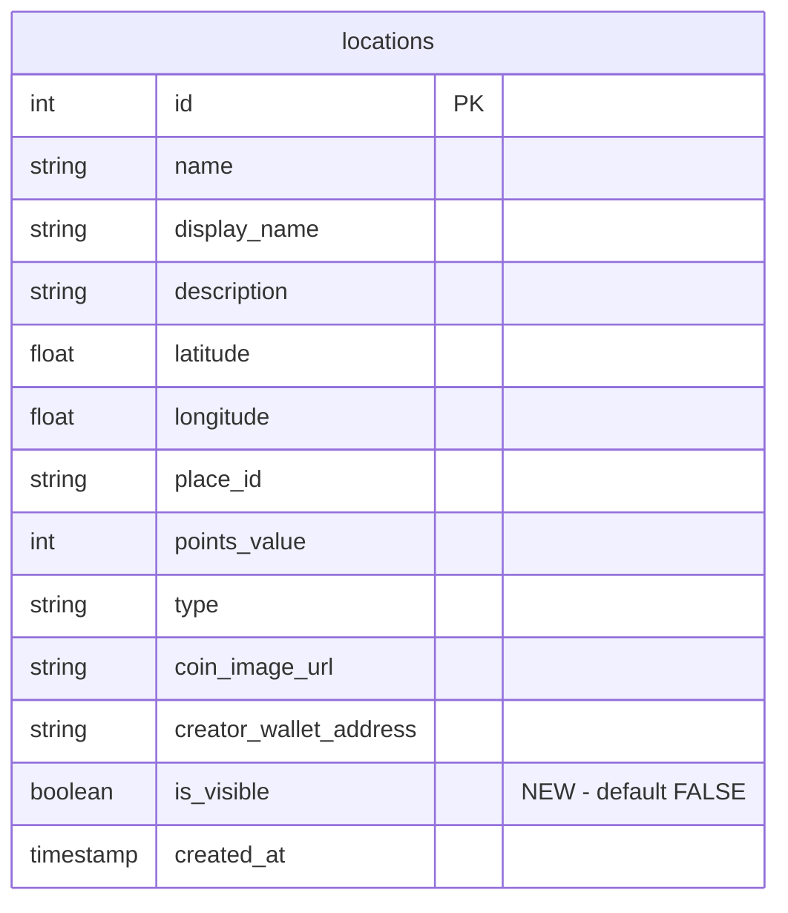

# feat: Admin Location Visibility Approval

## Overview

Add an admin approval workflow for locations. Locations will be hidden by default (`is_visible = false`) and only appear on the public map after an admin approves them. Admins can toggle visibility and edit location details from a dedicated admin page.

## Problem Statement / Motivation

Currently, any user-created location immediately appears on the public map. This can lead to:
- Spam or inappropriate locations being visible
- Locations with incorrect information being displayed
- No quality control over the map experience

An approval workflow ensures a curated, high-quality map experience.

## Proposed Solution

1. **Database**: Add `is_visible` boolean column to `locations` table (default `false`)
2. **API Updates**: Add `?includeHidden=true` param to existing `/api/locations` for admin use
3. **Check-in Validation**: Reject check-ins at hidden locations
4. **Admin Page**: New `/admin/locations` page with table and toggle switches

## Technical Considerations

### Architecture Impacts
- All public location queries must filter by `is_visible = true`
- Admin queries use `?includeHidden=true` parameter on existing endpoint
- Check-in validation must reject hidden locations (critical)

### Migration Strategy
- Use `DEFAULT TRUE` initially so existing locations stay visible
- Then `ALTER COLUMN SET DEFAULT FALSE` for new locations
- No race condition, no UPDATE needed

### Security
- Admin param protected by `requireAdmin()` check
- Sanitize search input to prevent SQL injection
- Add `is_visible` to allowed update fields in existing PATCH endpoint

## Acceptance Criteria

### Database
- [ ] Add `is_visible` BOOLEAN column with safe migration
- [ ] Add index on `is_visible` for query performance

### Public API Filtering
- [ ] `GET /api/locations` filters by `is_visible = true` by default
- [ ] `GET /api/locations?includeHidden=true` returns all (admin only)
- [ ] `POST /api/locations` creates locations with `is_visible = false`
- [ ] **Check-in attempts at hidden locations return 403 error** (critical)

### Admin Page (`/app/admin/locations/page.tsx`)
- [ ] Protected by admin auth check
- [ ] Table displays locations with: Name, Type, Created, Visible toggle
- [ ] Default view shows hidden locations (pending approval)
- [ ] Checkbox to "Show approved" locations
- [ ] Pagination (50 per page)
- [ ] Toast notifications on success/error

### Admin API
- [ ] `PATCH /api/admin/locations/[id]` accepts `isVisible` in update payload
- [ ] Update `updateLocationById` type signature to include `is_visible`

## Success Metrics

- Admin can approve/hide locations in < 3 clicks
- Map only displays approved locations
- Zero disruption to existing visible locations during deployment

## Implementation Plan

### Step 1: Database Migration

**File**: `database/add-is-visible-to-locations.sql`

```sql
-- Add is_visible column to locations table
-- Safe migration: existing locations visible, new locations hidden

BEGIN;

-- Add column with DEFAULT TRUE (existing rows get TRUE)
ALTER TABLE locations
ADD COLUMN IF NOT EXISTS is_visible BOOLEAN NOT NULL DEFAULT TRUE;

-- Change default for future inserts to FALSE
ALTER TABLE locations ALTER COLUMN is_visible SET DEFAULT FALSE;

-- Add index for filtering
CREATE INDEX IF NOT EXISTS idx_locations_is_visible ON locations(is_visible);

COMMIT;
```

### Step 2: Type Definitions

**File**: `lib/types.ts`

```typescript
// Add to Location interface (around line 22-42)
export interface Location {
  // ... existing fields
  is_visible: boolean;
}
```

**File**: `lib/db/locations.ts` - Update `updateLocationById` type signature

```typescript
// Add is_visible to the Pick type (around line 73-102)
export const updateLocationById = async (
  locationId: number,
  updates: Partial<
    Pick<
      Location,
      | "name"
      | "display_name"
      | "description"
      // ... existing fields
      | "is_visible"  // ADD THIS
    >
  >,
) => { ... }
```

### Step 3: Public API Updates

**File**: `app/api/locations/route.ts`

```typescript
// In GET handler - add visibility filter with admin override
import { checkAdminPermission } from "@/lib/auth";

export async function GET(request: NextRequest) {
  const { searchParams } = new URL(request.url);
  const includeHidden = searchParams.get("includeHidden") === "true";

  // Only allow includeHidden if admin
  if (includeHidden) {
    const adminEmail = request.headers.get("x-user-email");
    if (!checkAdminPermission(adminEmail || undefined)) {
      return NextResponse.json({ error: "Unauthorized" }, { status: 403 });
    }
  }

  let query = supabase
    .from("locations")
    .select(...)
    .not("coin_image_url", "is", null);

  // Filter by visibility unless admin requested all
  if (!includeHidden) {
    query = query.eq("is_visible", true);
  }

  // ... rest of handler
}

// In POST handler - set is_visible to false for new locations
const insertData = {
  // ... existing fields
  is_visible: false,
};
```

### Step 4: Check-in Validation (Critical)

**File**: `app/api/location-checkin/route.ts` (or equivalent check-in endpoint)

```typescript
// After getting/validating the location, check visibility
if (!location.is_visible) {
  return NextResponse.json(
    { error: "This location is not available for check-ins" },
    { status: 403 }
  );
}
```

### Step 5: Admin PATCH Endpoint Update

**File**: `app/api/admin/locations/[locationId]/route.ts`

```typescript
// Add isVisible to the update schema
const updateLocationSchema = z.object({
  // ... existing fields
  isVisible: z.boolean().optional(),
});

// In PATCH handler, map isVisible to is_visible
if (validData.isVisible !== undefined) {
  updates.is_visible = validData.isVisible;
}
```

### Step 6: Admin Page UI

**File**: `app/admin/locations/page.tsx` (new file)

```typescript
"use client";

import { useState } from "react";
import { usePrivy } from "@privy-io/react-auth";
import { useQuery, useMutation, useQueryClient } from "@tanstack/react-query";
import { Switch } from "@/components/ui/switch";
import { Button } from "@/components/ui/button";
import { toast } from "sonner";

export default function AdminLocationsPage() {
  const { user } = usePrivy();
  const queryClient = useQueryClient();
  const [showApproved, setShowApproved] = useState(false);
  const [page, setPage] = useState(1);
  const LIMIT = 50;

  // Admin auth check (same pattern as location-lists page)
  const [isAdmin, setIsAdmin] = useState(false);
  // ... auth check effect

  // Fetch locations using existing endpoint with includeHidden
  const { data, isLoading } = useQuery({
    queryKey: ["admin-locations", showApproved, page],
    queryFn: async () => {
      const res = await fetch(`/api/locations?includeHidden=true`, {
        headers: { "x-user-email": user?.email?.address || "" },
      });
      const json = await res.json();
      return json.data?.locations || [];
    },
    enabled: !!isAdmin,
  });

  // Filter client-side based on showApproved checkbox
  const locations = data?.filter((loc: Location) =>
    showApproved ? true : !loc.is_visible
  ) || [];

  // Paginate client-side
  const paginatedLocations = locations.slice((page - 1) * LIMIT, page * LIMIT);

  // Toggle visibility mutation - simple invalidation (no optimistic updates)
  const toggleMutation = useMutation({
    mutationFn: async ({ id, isVisible }: { id: number; isVisible: boolean }) => {
      const res = await fetch(`/api/admin/locations/${id}`, {
        method: "PATCH",
        headers: {
          "Content-Type": "application/json",
          "x-user-email": user?.email?.address || "",
        },
        body: JSON.stringify({ isVisible }),
      });
      if (!res.ok) throw new Error("Failed to update");
      return res.json();
    },
    onSuccess: () => {
      queryClient.invalidateQueries({ queryKey: ["admin-locations"] });
      toast.success("Visibility updated");
    },
    onError: () => {
      toast.error("Failed to update visibility");
    },
  });

  if (!isAdmin) return <div>Unauthorized</div>;

  return (
    <div className="p-6">
      <h1 className="text-2xl font-bold mb-4">Location Approval</h1>

      <label className="flex items-center gap-2 mb-4">
        <input
          type="checkbox"
          checked={showApproved}
          onChange={(e) => setShowApproved(e.target.checked)}
        />
        Show approved locations
      </label>

      <table className="w-full">
        <thead>
          <tr>
            <th>Name</th>
            <th>Type</th>
            <th>Created</th>
            <th>Visible</th>
          </tr>
        </thead>
        <tbody>
          {paginatedLocations.map((location: Location) => (
            <tr key={location.id}>
              <td>{location.display_name}</td>
              <td>{location.type}</td>
              <td>{new Date(location.created_at).toLocaleDateString()}</td>
              <td>
                <Switch
                  checked={location.is_visible}
                  disabled={toggleMutation.isPending}
                  onCheckedChange={(checked) =>
                    toggleMutation.mutate({ id: location.id, isVisible: checked })
                  }
                />
              </td>
            </tr>
          ))}
        </tbody>
      </table>

      {/* Pagination */}
      <div className="flex gap-2 mt-4">
        <Button
          onClick={() => setPage(p => Math.max(1, p - 1))}
          disabled={page === 1}
        >
          Previous
        </Button>
        <Button
          onClick={() => setPage(p => p + 1)}
          disabled={paginatedLocations.length < LIMIT}
        >
          Next
        </Button>
      </div>
    </div>
  );
}
```

### Step 7: Install Switch Component

```bash
npx shadcn@latest add switch
```

## Files to Modify/Create

| File | Action | Purpose |
|------|--------|---------|
| `database/add-is-visible-to-locations.sql` | Create | Migration script |
| `lib/types.ts` | Modify | Add `is_visible` to Location type |
| `lib/db/locations.ts` | Modify | Add `is_visible` to `updateLocationById` type |
| `app/api/locations/route.ts` | Modify | Add visibility filter + admin override |
| `app/api/location-checkin/route.ts` | Modify | **Reject hidden locations (critical)** |
| `app/api/admin/locations/[locationId]/route.ts` | Modify | Add `isVisible` to update schema |
| `app/admin/locations/page.tsx` | Create | Admin management UI |

## ERD Diagram



## Review Feedback Applied

| Original | Changed To | Reason |
|----------|-----------|--------|
| New `GET /api/admin/locations` endpoint | Extend `/api/locations` with `?includeHidden=true` | Simplicity - one endpoint |
| `updateLocationVisibility` function | Use existing `updateLocationById` | No unnecessary abstraction |
| Optimistic updates | Simple `invalidateQueries` | Reduces complexity, admin tool doesn't need 200ms faster UX |
| Filter tabs (All/Visible/Hidden) | Checkbox "Show approved" defaulting to hidden | Simpler, focuses on approval queue |
| No check-in validation | **Added as critical step** | Production bug if missing |
| Race condition in migration | Changed to DEFAULT TRUE then ALTER DEFAULT FALSE | Cleaner, no UPDATE needed |

## References

### Internal References
- Admin page pattern: `app/admin/location-lists/page.tsx:197-291`
- Auth middleware: `lib/auth.ts:1-50`
- Location types: `lib/types.ts:22-42`
- Location DB operations: `lib/db/locations.ts:1-128`
- Existing location update API: `app/api/admin/locations/[locationId]/route.ts:20-86`

### External References
- [shadcn/ui Switch](https://ui.shadcn.com/docs/components/switch)
- [Next.js 14 Route Handlers](https://nextjs.org/docs/14/app/building-your-application/routing/route-handlers)
